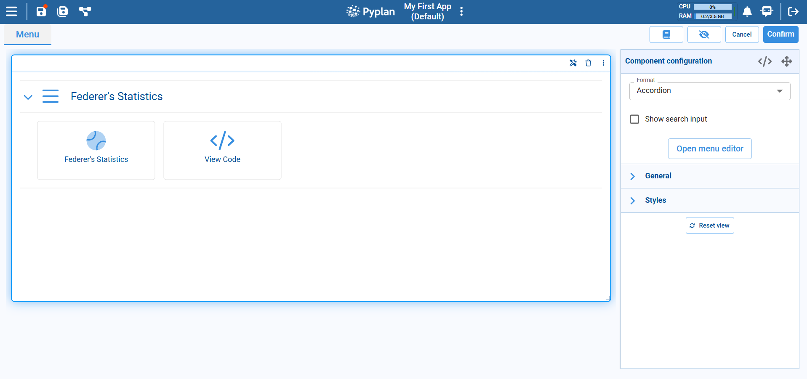
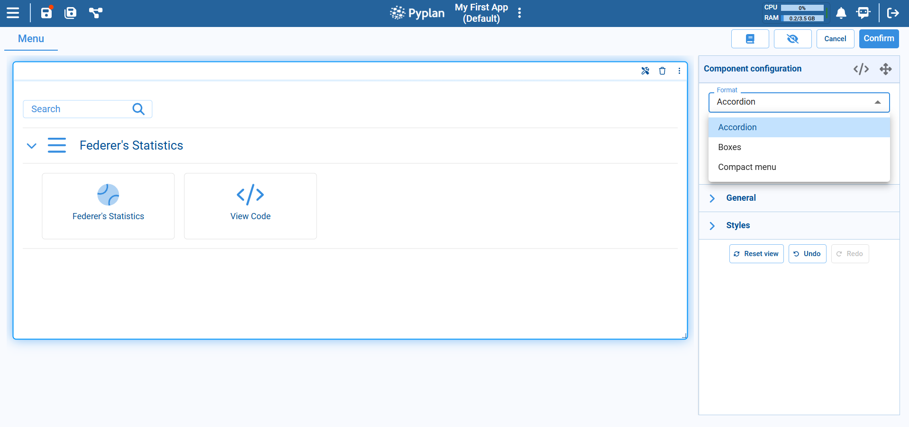
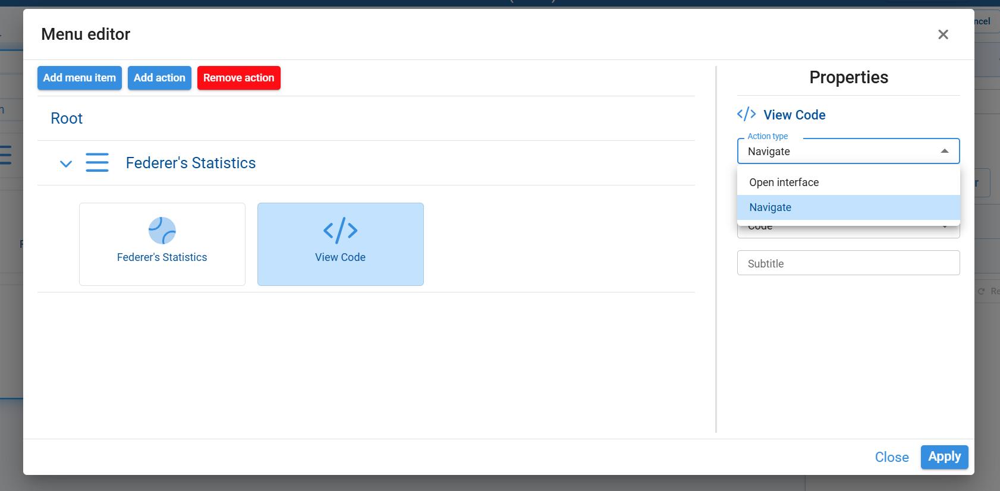

# Menu Component

The Menu component is used to build navigation menus inside a Pyplan interface. With it you can group links to different interfaces or actions in a single, structured component, making it easier for users to move through the application.

## Adding and Configuring a Menu

After placing a Menu component on the canvas, configure it from the **Component configuration** panel on the right.

### Format

At the top of the configuration you choose the **Format** of the menu. The dropdown offers several layouts:

- **Accordion**: Groups items into expandable sections. Each section can contain one or more actions or links.
- **Boxes**: Displays menu entries as separate tiles or cards.
- **Compact menu**: Shows a more condensed list, useful when you have many items and less space.

The selected format affects only the visual presentation; the underlying menu structure and actions remain the same.

### Search Input

For large menus, you can enable **Show search input**. This adds a search box at the top of the Menu component so users can quickly filter entries by typing part of the menu item name.

### Menu Editor

To define the content and structure of the menu, click **Open menu editor** in the configuration panel.

From the menu editor you can:

**Top buttons:**
- **Add menu item**: Creates a new section or group under the Root.
- **Add action**: Adds a new clickable item inside the selected section.
- **Remove action**: Deletes the selected action or item.

**Left side — menu tree:**
Shows the hierarchical structure of sections and actions.

**Right side — Properties panel:**
For the selected item, you can configure:
- The item name.
- **Action type** dropdown, where you choose what the item does when clicked:
  - **Open interface**: Opens a specific interface in the application.
  - **Navigate**: Navigates to another area of the app (for example, Code, Interfaces, Scenarios, etc.).
- Additional fields such as the target interface or section, and optional descriptive subtitle text.

After configuring the properties, click **Apply** to save the menu changes and close the editor, or **Close** to exit without applying modifications.

### General and Styles

- Under **General** you configure basic options for the component, such as its title and behavior.
- Under **Styles** you control the visual appearance — font, colors, alignment, spacing, and related layout options — so that the component matches the overall design of the interface.

### Typical Usage

The Menu component is commonly used to:

- Create a home page for an application, with grouped links to the main interfaces.
- Organize thematic sections (e.g., "Planning", "Reports", "Admin") each containing several entries.
- Offer a compact navigation bar inside a complex interface, so users can jump to the views they need without leaving the current app.
