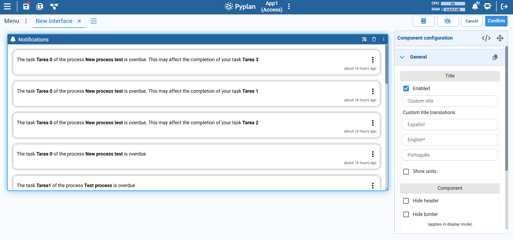

# Notifications Component

The Notifications component keeps you informed about everything that matters in the application: overdue tasks, process events, and other relevant alerts. It centralizes messages related to your work so you can react quickly and stay aligned with the rest of the team.

Each notification shows:

- A message describing the event (for example, a delayed task that may impact another one).
- A relative timestamp (e.g., *about 16 hours ago*), so you know how recent the event is.
- A context menu, accessible via the ellipsis icon on the right, to mark the notification as read.

The Notifications component typically shows only the notifications that are relevant to the current user — for example, tasks where you are responsible or subscriber, or processes in which you participate.

## Typical Usage

The Notifications component is commonly added to:

- A **home interface** or user dashboard, so each user immediately sees their most important alerts.
- A **process monitoring page**, where overdue tasks and critical events are highlighted.

By surfacing task and process events in one place, the Notifications component improves communication and helps you respond to issues before they impact the rest of the workflow.
