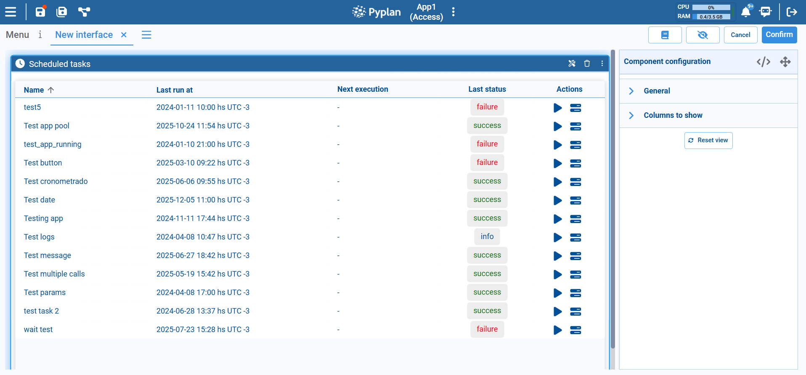

# Scheduled Tasks Component

The Scheduled Tasks component lets you monitor and control the scheduled jobs defined for the application. These jobs execute code automatically at predefined times or intervals, so you can automate repetitive processes and ensure that critical operations run on schedule.

## Main Layout

Each row in the table corresponds to a scheduled task and includes the following columns:

| Column | Description |
|---|---|
| **Name** | The name of the scheduled task, identifying the process being automated (e.g., a nightly refresh or a periodic report). |
| **Last run at** | Date and time of the most recent execution, including time zone. Helps verify when the task last ran. |
| **Next execution** | The next planned run of the task according to its schedule. Appears as `-` when the schedule is disabled or not yet configured. |
| **Last status** | Result of the last execution, shown as a colored label: `success`, `failure`, or `info`. |
| **Actions** | Action icons to interact with the task: **Run now** (play icon) to trigger the task immediately, and **Task logs** (stack icon) to open logs for troubleshooting. |

## Typical Usage

The Scheduled Tasks component is typically placed in:

- **Administrative interfaces** used by power users or IT teams to monitor background jobs.
- **Operations dashboards** where you need to confirm that data loads, model runs, and notifications are being executed on time.

By exposing task names, last run times, next execution, and status in one place — and allowing manual runs and access to logs — the Scheduled Tasks component makes it easy to supervise automation and quickly resolve issues when a job fails.
