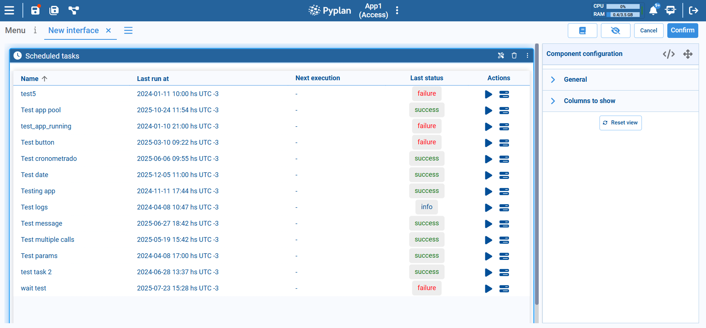

# Scheduled Tasks Component

The Scheduled Tasks component lets you monitor and control the scheduled jobs defined for the application. These jobs execute code automatically at predefined times or intervals, so you can automate repetitive processes and ensure that critical operations run on schedule.

## Main Layout

Each row in the table corresponds to a scheduled task and includes the following columns:

| Column | Description |
|---|---|
| **Name** | The name of the scheduled task, identifying the process being automated (e.g., a nightly refresh or a periodic report). |
| **App** | The application the task runs against. Hidden by default. |
| **Node** | The node executed by the task. Hidden by default. |
| **Last run at** | Date and time of the most recent execution, including time zone. Helps verify when the task last ran. |
| **Next execution** | The next planned run of the task according to its schedule. Appears as `-` when the schedule is disabled or not yet configured. |
| **Last status** | Result of the last execution, shown as a colored label: `success`, `failure`, or `info`. |
| **Actions** | Action icons to interact with the task: **Info** to review its configuration, **Run task** (play icon) to trigger it immediately, and **Show task log** (stack icon) to open logs for troubleshooting. |

You choose which columns and which actions are shown — see [Configuration](#configuration).

## Keeping the Table Up to Date

Task states change while the interface stays open, so the component offers three ways to see fresh values:

- **Refresh**: the component's context menu (the ellipsis icon) includes a **Refresh** option that reloads the table. Only the values are updated — your current page, sorting, and filters are kept.
- **After running a task**: when you trigger a task with **Run task**, the table refreshes on its own a couple of seconds later, so the new execution shows up without any extra clicks.
- **Automatic update**: when enabled in the configuration, the table reloads by itself at a fixed interval. To avoid loading the server from interfaces left open all day, the automatic update stops after 10 minutes; a manual **Refresh** starts that period again. Updates also pause while the browser tab is in the background.

## Configuration

Select the component in edit mode to configure it:

| Section | Options |
|---|---|
| **Columns** | Which of the columns described above are shown. |
| **Actions** | Which row actions are offered: **Info**, **Run task**, and **Show task log**. If you turn all of them off, the Actions column is not shown at all, even when it is selected under Columns. |
| **Automatic update** | **Update automatically** turns the automatic reload on (off by default), and **Every (seconds)** sets the interval (60 seconds by default). |
| **Filters** | Whether to list only the tasks of the current application, show the search bar, and hide disabled tasks. |

## Typical Usage

The Scheduled Tasks component is typically placed in:

- **Administrative interfaces** used by power users or IT teams to monitor background jobs.
- **Operations dashboards** where you need to confirm that data loads, model runs, and notifications are being executed on time.

By exposing task names, last run times, next execution, and status in one place — and allowing manual runs and access to logs — the Scheduled Tasks component makes it easy to supervise automation and quickly resolve issues when a job fails.
