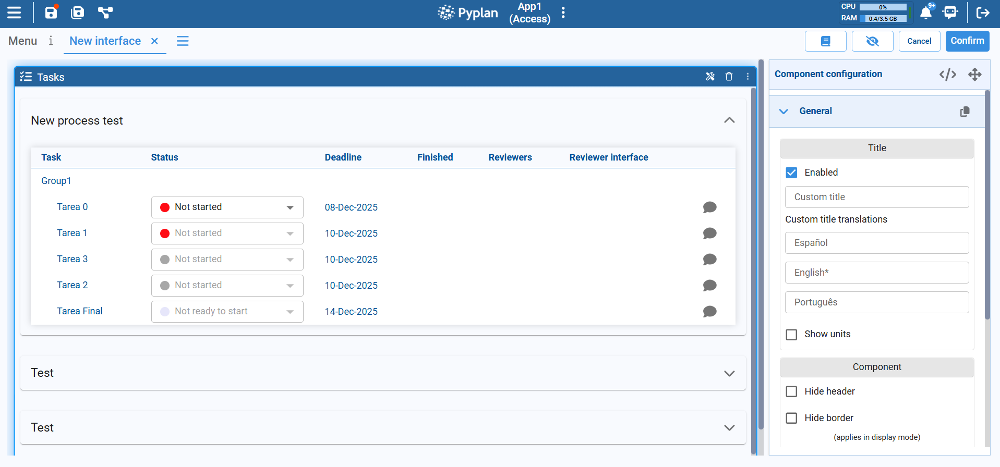

# Tasks Component

The Tasks component lets you efficiently control the workflow of an application by assigning tasks to users and tracking their progress. It is designed to support collaboration, review cycles, and clear accountability across a planning or data-entry process.

This component displays only the tasks in which you are involved. It lists the tasks where you appear either as:

- **Responsible**: you are in charge of completing the task.
- **Subscriber / follower**: you are notified about the task's progress, even if you are not the main responsible.

Tasks that do not include you in any of these roles are not shown in this component.
