# Upload Manager

The Upload Manager component centralizes file upload and download actions, avoiding the need to navigate to the file manager or implement a custom component for basic file handling functions.

It is added to the interface during the editing phase by dragging the icon and creating a new component that initially appears as an empty table.

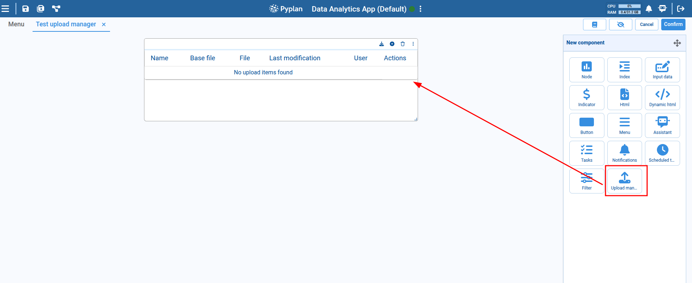

Once the component is created, each new item must be configured using the **Add** button in the component header.

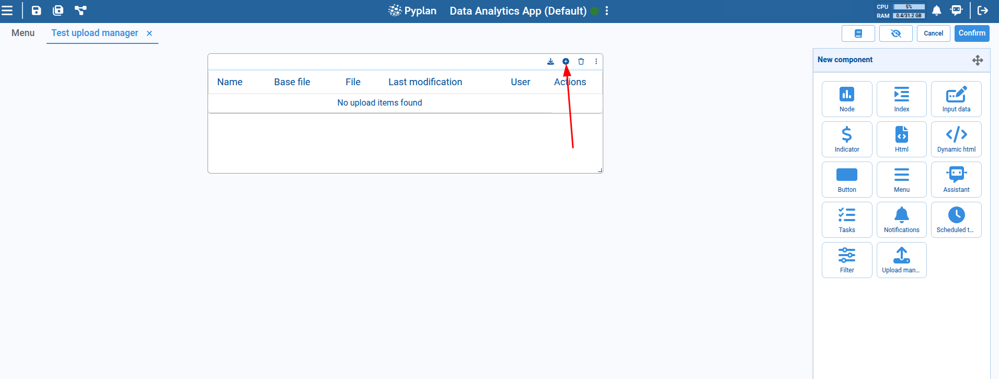

## Upload Item Configuration

Clicking **Add** opens a dialog with the basic configuration options for each item in the component. Each item corresponds to a file that will be uploaded or downloaded. The configuration options include:

- **Item name**: A descriptive name that represents what the file is or its purpose.
- **Path selection mode**: Specifies how the file path will be selected. It can be a fixed path defined as "Custom," a path relative to the application, or a path relative to the application version.
- **File path**: Specifies the file's location in the system. A checkbox above this field allows you to choose whether to preserve or modify the file name when uploading a new file (default: preserve the file name).
- **Base file path**: Defines a base file that can serve as a reference or template. When uploading a new file, this reference can be used to perform field or structure validations.

:::note
The file path fields must refer to a file that already exists in the system and has been previously uploaded via the file manager.
:::

Below the file path configuration, there is an optional section to define nodes that perform actions when a new file is uploaded:

- **Validation node**: Runs custom validations when a new file is being uploaded. It should be a function-type node that receives a file path as a parameter and returns a boolean indicating validation success.
- **Callback node**: Executed once the file has been successfully uploaded. It allows for additional actions such as notifying the user or updating other components. It is a function-type node that receives no parameters and returns no value.
- **Invalidation node**: Also executed after a successful upload but used to invalidate a selected node for a specific purpose. No specific structure is required.
- **History count**: A numeric field to define how many historical versions of the uploaded files the item will keep.

**File mode options:**
- **Select file mode** (default): A checkbox lets you choose to preserve the current file name or replace it with the uploaded file's name. In this mode, the current file path input must be a file — folders are not allowed.
- **Select folder mode**: Only a directory can be chosen. Files uploaded to this directory will not overwrite each other, unlike in file mode where each new upload replaces the previous one.

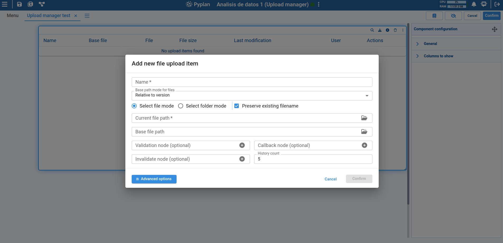

### Advanced Options

Click **Advanced Options** to access additional settings:

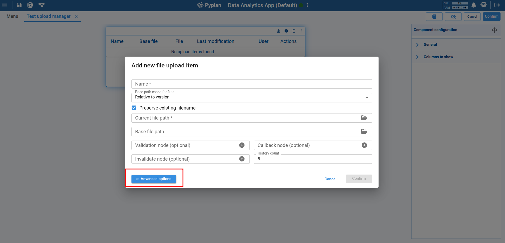

- **History path**: Defines a path where historical versions of uploaded files will be stored. If not specified, the system uses the same directory as the current file.
- **Select an interface to navigate to**: Lets you navigate to a specific interface to validate special behavior when uploading a new file.
- **Additional information of file**: Allows adding extra information about an item, displayed in the table as a tooltip.
- **Automatic validations based on base file**: Three checkbox options that activate automatic validations:
  1. Spreadsheet validation: Checks if the spreadsheet complies with a specific format.
  2. Column name validation: Ensures column names match the expected names.
  3. Data type validation: Verifies that data types match the expected types.

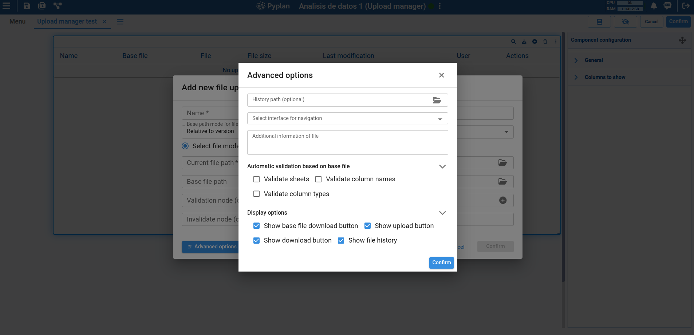

At the bottom, you can choose to show or hide action icons for each item:
1. Show base file download button
2. Show uploaded file download button
3. Show upload new file button
4. Show upload history button

## Table with New Configured Item

Once configured, items are displayed in the component's table with: item name, base file name, current file, date and time of last modification, the user who modified it, and available actions.

Each row represents an uploaded or downloadable file, and allows actions such as downloading the base file, downloading the uploaded file, viewing the upload history, uploading a new file, or navigating to an interface.

In component editing mode, each item can be modified or deleted.

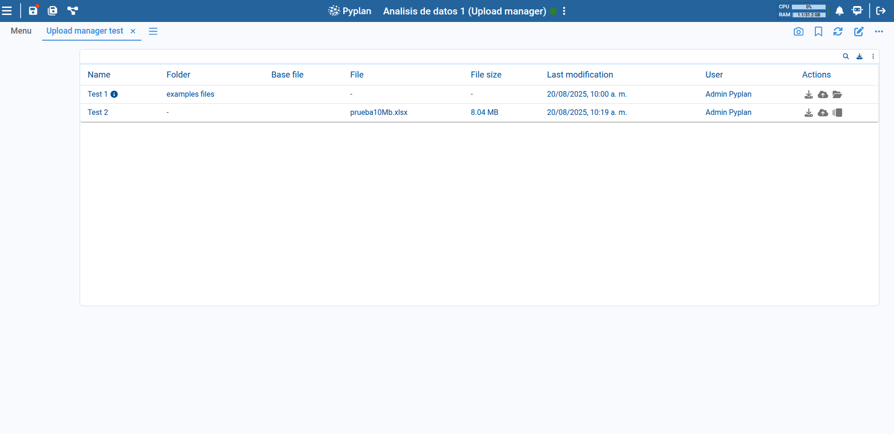

## Actions on Items

### Uploading a File

Click the upload button to open a dialog where you can select the file to upload.

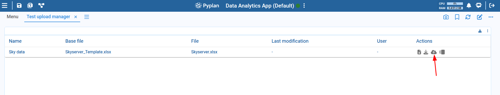

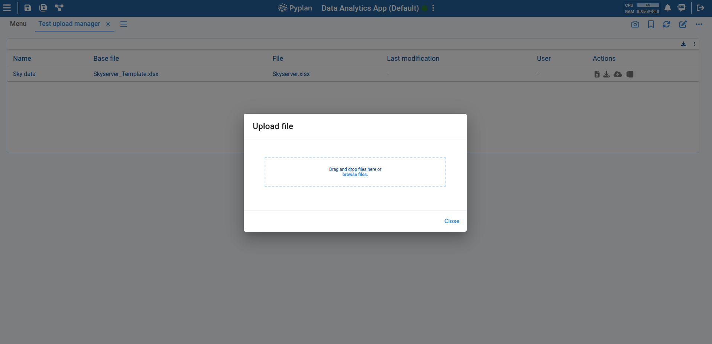

Once selected, automatic validations are performed and the file is uploaded into the system.

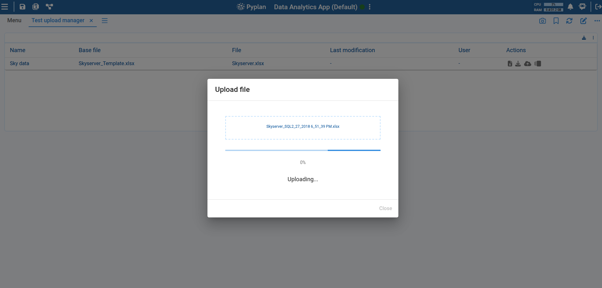

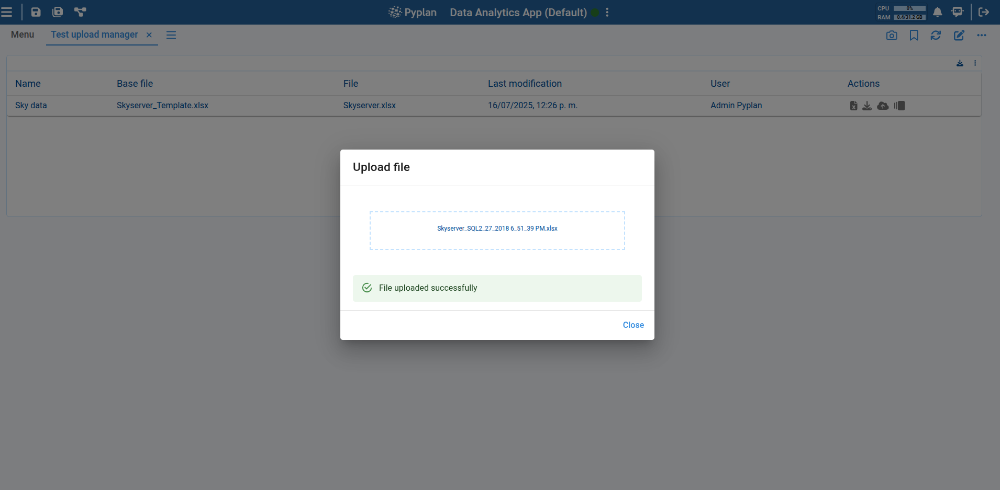

After a successful upload, the component's table is updated to reflect the new file, showing the user who performed the upload and the upload date, as well as the size of the newly uploaded file.

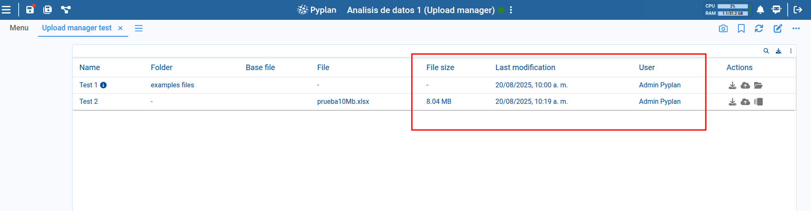

### Viewing Upload History

Click the history button to open a dialog showing previously uploaded files with details such as upload date, the user who uploaded them, and file size. From this dialog, you can also download previously uploaded files, restore a file from history (replacing the current file with the selected version), or delete a history item.

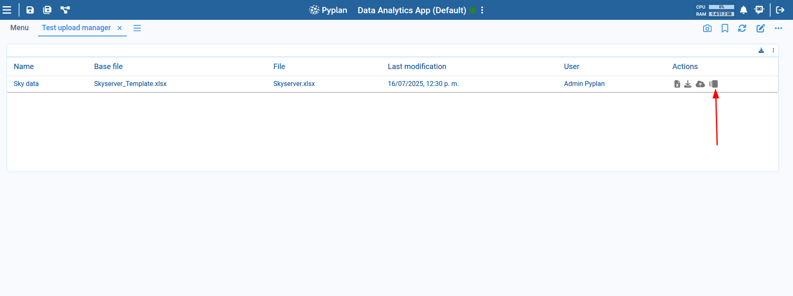

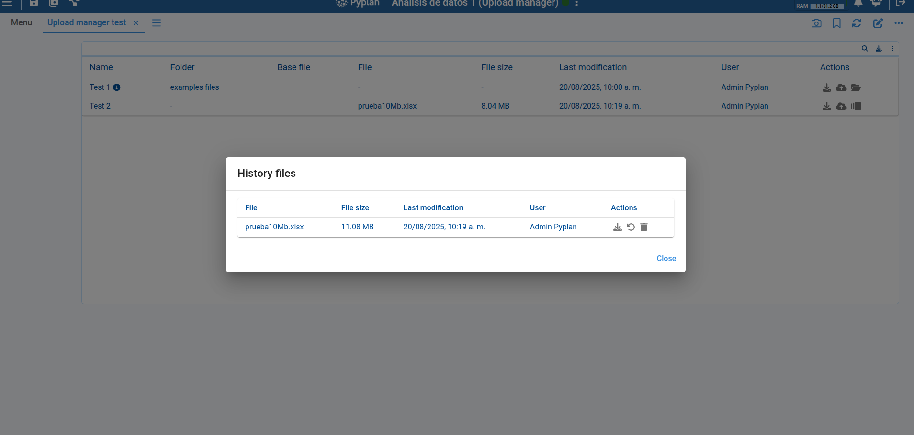

### Folder Mode

If the **Select folder mode** option is selected, the uploaded files within the folder can be accessed for download or deletion. The table item will display a folder icon and will not have a history, since files are uploaded without being overwritten.

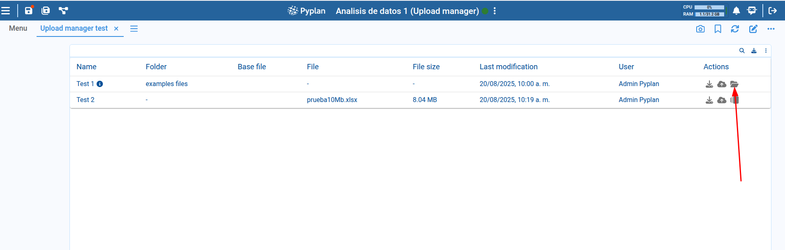

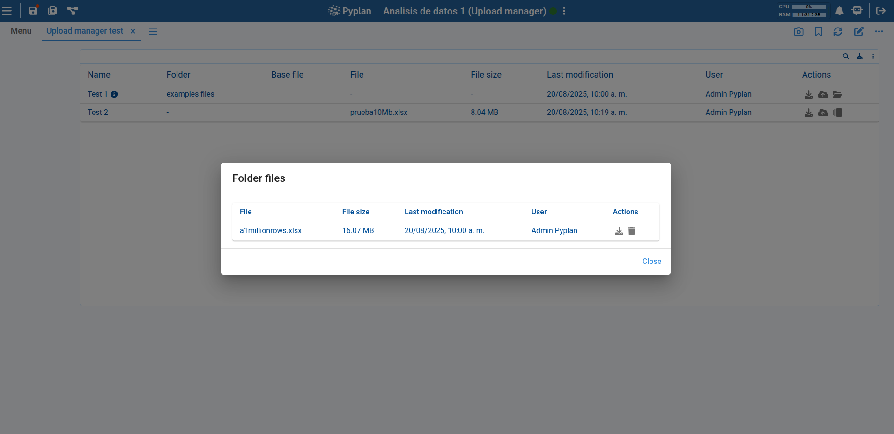

### Customizing Columns

In component editing mode, you can choose which columns to display in the component's table item list.

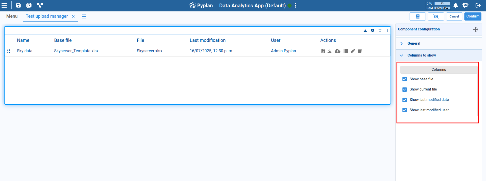

### Reordering Items

Reorder items in the table by dragging them to the desired position using the icon on the left side of each item.

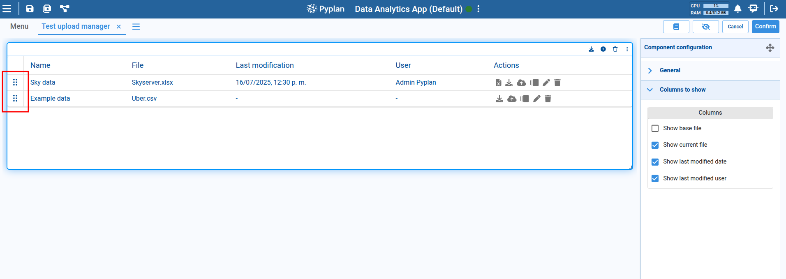
