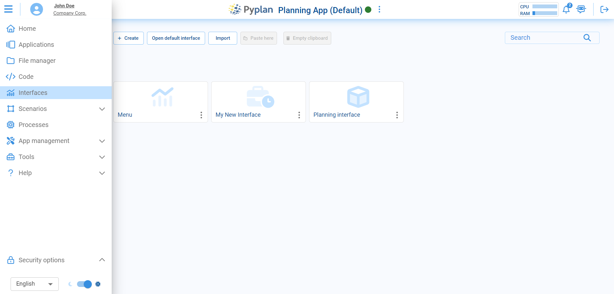
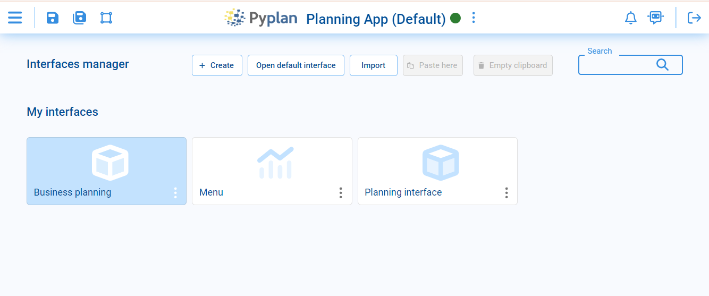
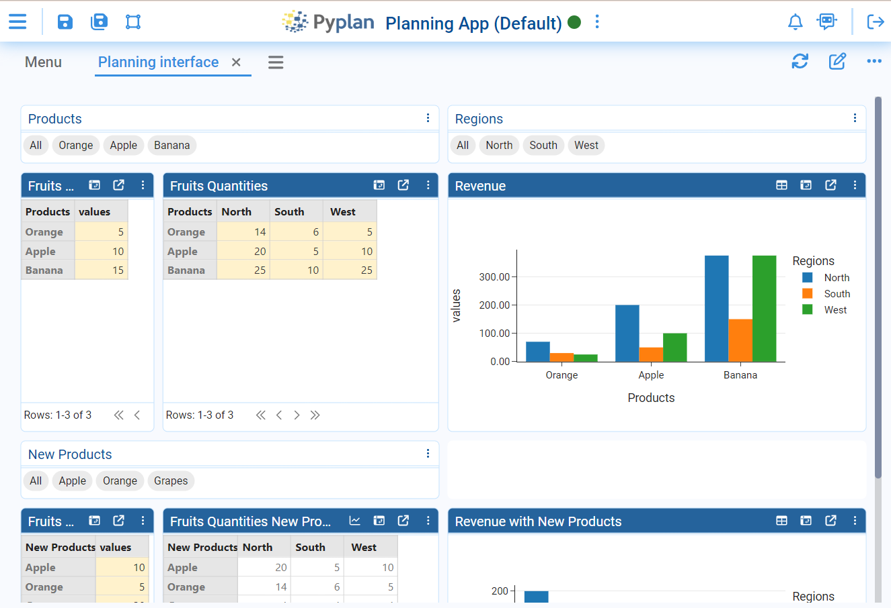
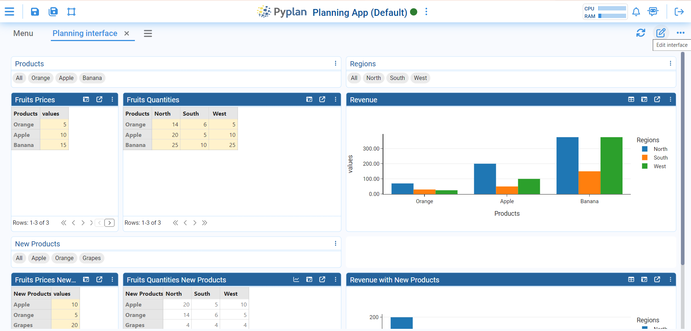
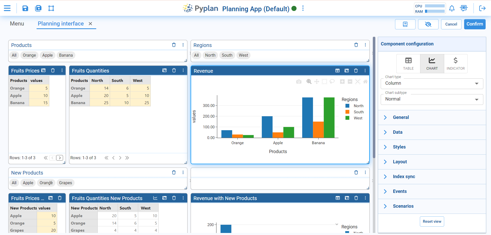

# Introduction to Interfaces

Manage input and output data seamlessly in Pyplan through intuitive interfaces. These interfaces are comprised of draggable components (widgets) available in a toolbox, facilitating easy customization on the interface screen. The components establish ongoing communication with calculation rules, fostering real-time interaction between users and applications. Instant computation of any modification to an input parameter ensures prompt presentation of the output result to the user.

To access the interfaces module, navigate to the **Interfaces** section in the main menu.

## Example: Data Planning - Planning App

When opening the Interfaces section, you will find options related to the example in development, such as creating interfaces for Planning App.

Clicking on "Planning interface" displays the interface with various input components and output graphics, demonstrating real-time interaction. Here you can see in a first line different input components to select a type of Products or Regions. Interacting with these components you can see the impact on the output graphics below.

## Editing Mode

By clicking the edit icon in the upper right corner, you access a comprehensive editing mode.

This mode enables efficient management of existing components and creation of new ones, offering tools for easy adjustments and improvements to your interface design. You can rearrange components, add new filters, or modify existing ones, providing a flexible and personalized planning experience.

