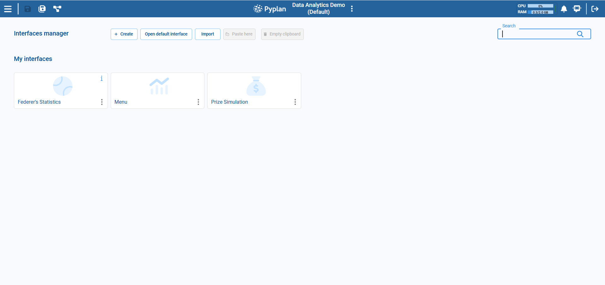

# Interface Manager

The Interface Manager serves as a central command hub, providing users with a robust set of tools to efficiently manipulate and customize interfaces. This section facilitates tasks such as editing, duplicating, importing and exporting interfaces. Users can enhance collaboration and exercise administrative control through functions like adding documentation, setting permissions, and managing unique interface identifiers. The Interface Manager's capabilities extend to organizational tasks, offering options to cut, copy, and delete interfaces. Additionally, users can generate interface links for easy sharing and copy interface IDs for seamless integration.

## Context Menu

In the context menu of the Interface Manager, users have access to a set of powerful options to fine-tune their interface interactions:

- **Edit**: Allows users to modify the settings, content, or appearance of the selected interface.
- **Duplicate**: Creates an identical copy of the selected interface.
- **Export**: Allows you to download the interface.
- **Add Documentation**: Allows users to attach or update documentation related to the selected interface.
- **Delete**: Removes the selected interface permanently.
- **Set Permissions**: Enables users to manage access rights and permissions for the selected interface.
- **Cut**: Removes the selected interface and places it in a clipboard for moving elsewhere.
- **Copy**: Creates a copy of the selected interface without removing it from its current location.
- **Copy Interface ID**: Copies a unique identifier associated with the interface to the clipboard.
- **Interface Link**: Generates a link to the selected interface.

