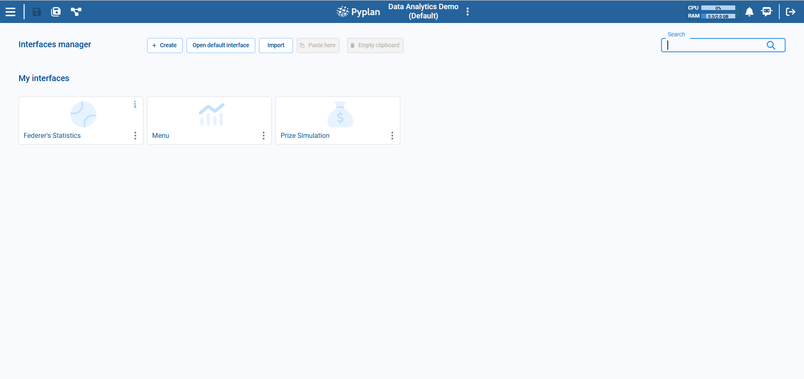
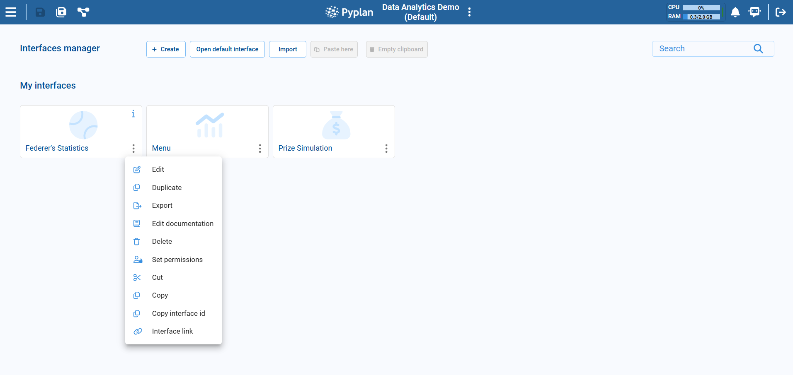
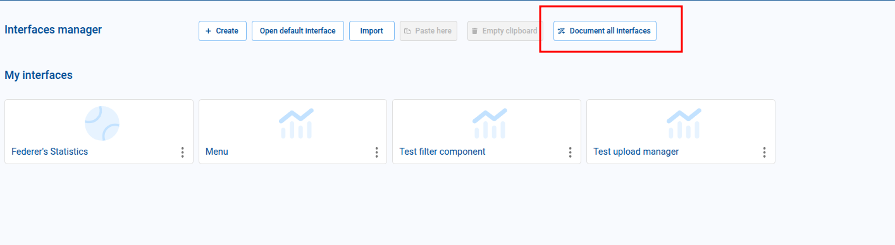
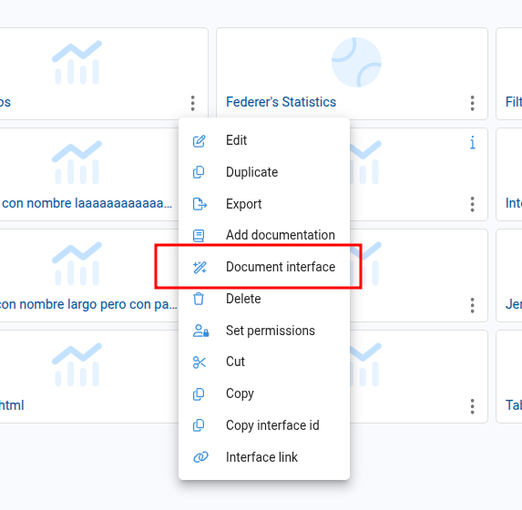
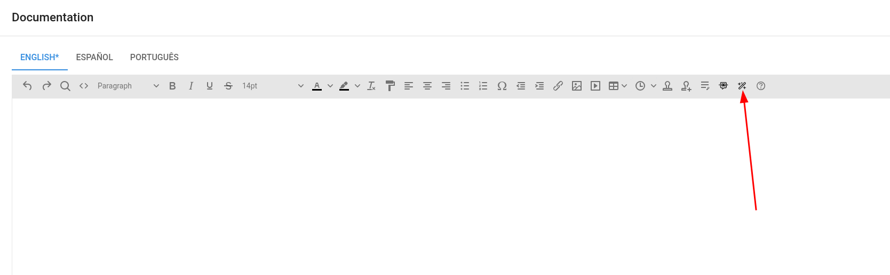
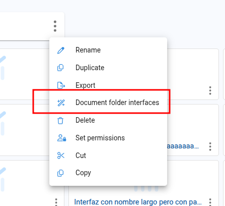
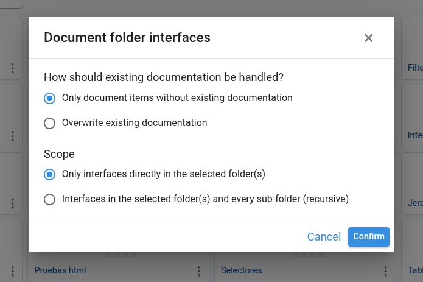

# Interface Manager

The Interface Manager serves as a central command hub, providing users with a robust set of tools to efficiently manipulate and customize interfaces. This section facilitates tasks such as editing, duplicating, importing and exporting interfaces. Users can enhance collaboration and exercise administrative control through functions like adding documentation, setting permissions, and managing unique interface identifiers. The Interface Manager's capabilities extend to organizational tasks, offering options to cut, copy, and delete interfaces. Additionally, users can generate interface links for easy sharing and copy interface IDs for seamless integration.

## Context Menu

In the context menu of the Interface Manager, users have access to a set of powerful options to fine-tune their interface interactions:

- **Edit**: Allows users to modify the settings, content, or appearance of the selected interface.
- **Duplicate**: Creates an identical copy of the selected interface.
- **Export**: Allows you to download the interface.
- **Add Documentation**: Allows users to attach or update documentation related to the selected interface.
- **Delete**: Removes the selected interface permanently.
- **Set Permissions**: Enables users to manage access rights and permissions for the selected interface.
- **Cut**: Removes the selected interface and places it in a clipboard for moving elsewhere.
- **Copy**: Creates a copy of the selected interface without removing it from its current location.
- **Copy Interface ID**: Copies a unique identifier associated with the interface to the clipboard.
- **Interface Link**: Generates a link to the selected interface.

## Automatic Documentation

Pyplan can generate the documentation of interfaces automatically. Instead of writing the description of each interface by hand, we ask Pyplan to analyze its components, title and folder structure and produce a description for us. The generated text is stored in the same documentation field that we would normally edit manually, so we can review and refine it afterwards.

The process runs in the background. While it is being generated we see a progress dialog with the current status, and the list of interfaces is refreshed automatically once it finishes.

:::info
To use the automatic generation, the application must have a **default language** configured in the **App properties**. If no language is configured, Pyplan shows a warning and the action is cancelled.
:::

### Document All Interfaces

From the top action bar of the Interface Manager, we can open the actions menu and select **Document all interfaces** to generate the documentation for every interface in the application.

A dialog opens where we choose **how** existing documentation should be handled:

- **Only document items without existing documentation** — interfaces that already have a description are skipped.
- **Overwrite existing documentation** — every interface is regenerated, replacing the previous description.

After confirming, a progress dialog shows how many interfaces have been processed and how many failed (if any).

### Document a Single Interface

We can document one interface at a time from its context menu. Right-clicking an interface opens the context menu where we select **Document interface**.

We can also generate the documentation while editing an interface's description. The **Add documentation** dialog shows a **Generate automatically** button that produces a draft description for the current interface, which we can then edit before saving.

### Document the Content of a Folder

When we right-click on a folder, the context menu offers a **Document folder interfaces** option that generates the documentation of every interface inside the folder.

The dialog asks us to choose the **scope**:

- **Only interfaces directly in the selected folder(s)** — only the interfaces placed directly under the folder are documented; nested folders are ignored.
- **Interfaces in the selected folder(s) and every sub-folder (recursive)** — every interface inside the folder hierarchy is documented.

We also choose, as in the other documentation actions, whether to **overwrite** existing documentation or only document interfaces **without an existing description**.

### Document a Selection of Interfaces or Folders

When we select multiple items in the Interface Manager (with the checkboxes or with `Ctrl + Click`), the context menu adapts to the current selection:

- **Document N selected interfaces** — appears when several interfaces are selected. Documents all of them in batch.
- **Document content of N selected folders** — appears when several folders are selected. Documents all the interfaces inside those folders, using the same scope options as **Document folder interfaces**.

:::tip
For large applications, the **Only document items without existing documentation** mode lets us re-run the process safely: previously documented interfaces are kept untouched and only the missing ones are generated. This is useful to continue an interrupted run or to incrementally document the app.
:::
