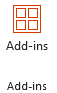
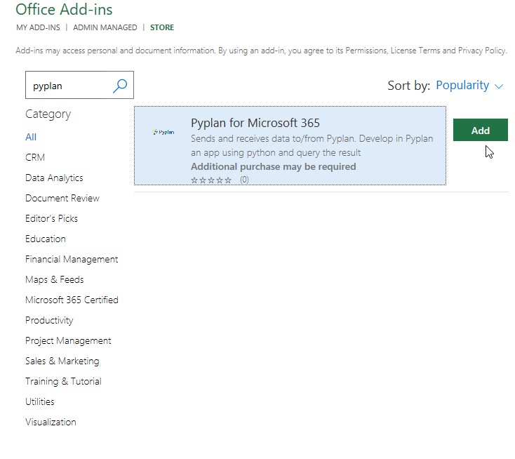
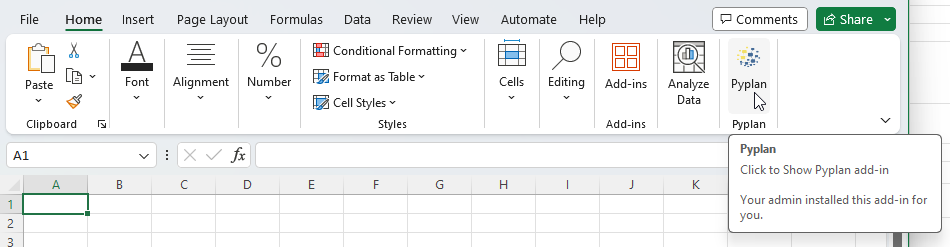
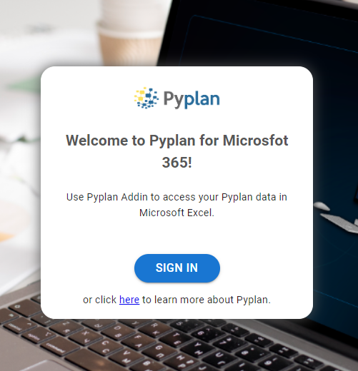
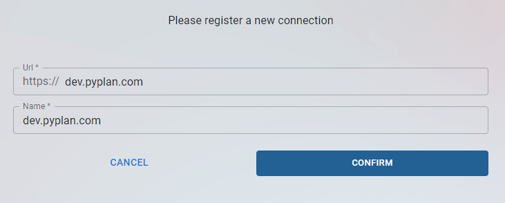
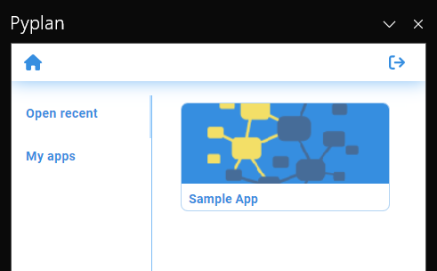
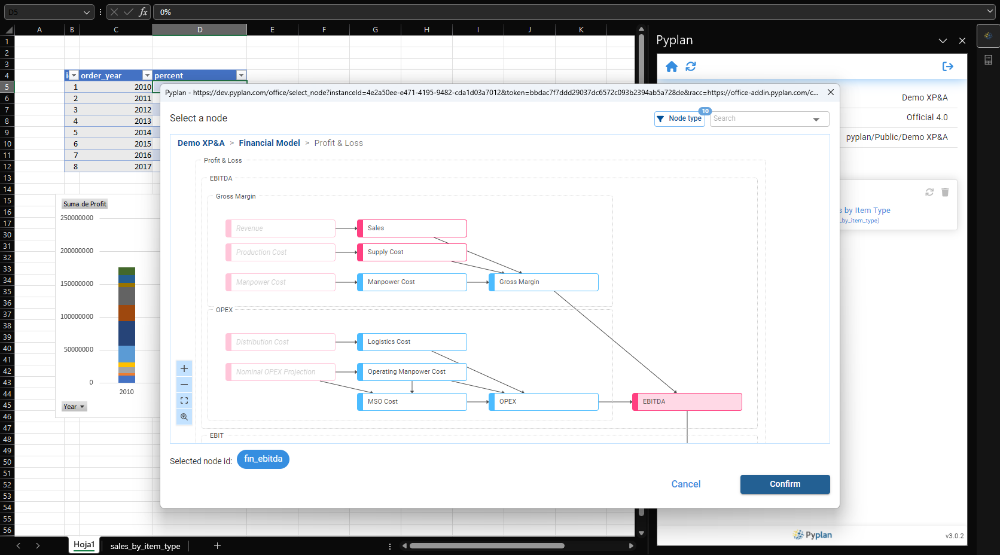
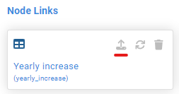

# Office Add-in

The Office add-in "Pyplan for Microsoft 365" allows users to send and receive information to and from a Pyplan application directly within Microsoft Excel.

## Install Using Microsoft Store (AppSource)

To add "Pyplan for Microsoft 365," click on the add-ins button in the Excel Menu.

Search for "Pyplan" in the store and press the **Add** button.

This action adds the Pyplan icon to the **Home** ribbon of your Excel.

When you press the Pyplan button, a task pane displays on the right side of your spreadsheet.

:::info Requirements
You will need a version of Excel that supports **ExcelApi 1.2** or higher. This requirement means that you need Excel versions later than Excel 2019, as ExcelApi 1.2 is supported in Office 365 and later builds. You should ideally be using Microsoft 365 (subscription-based) or newer Office versions to ensure compatibility.
:::

## Install Using Microsoft 365 Admin Center (for Administrators)

You can install the "Pyplan for Microsoft 365" add-in following the steps detailed in the [Microsoft documentation](https://learn.microsoft.com/en-us/microsoft-365/admin/manage/manage-deployment-of-add-ins?view=o365-worldwide).

You will probably need the manifest file (`manifest.xml`) of the add-in. You can download the file from: `https://office-addin.pyplan.com/manifest.xml`

## Requirements

For the proper functioning of the add-in "Pyplan for Microsoft 365", access to the following URLs is required:

- `https://office-addin.pyplan.com/`
- Your Pyplan URL

## Login

To log in to a Pyplan instance, you first need to register that instance:

1. Click on the **Sign in** button.

2. If it is the first time you are logging in, register the instance you wish to connect to. Click the **+** button, fill in the instance data, and click **Confirm**.

:::tip
If you use Single Sign On (SSO), you must add `/saml/[company code]` to the URL. Example: `https://dev.pyplan.com/saml/pyplan`
:::

3. Once registered, the connection will be available for future logins. Click on the connection you wish to use and log in using your credentials.

## Open an Application

After logging in, you can open any of the applications you have available — from your private space, from the public space, or from a work team to which you belong.

## Node Links

Node Links are links between Microsoft Excel spreadsheets or ranges and Pyplan nodes. These links allow you to send and receive information to and from your Pyplan application.

### Node Links Types

There are two types of Node Links:

- **Data output**: allow obtaining data from Pyplan.
- **Data input**: allow sending data to Pyplan.

**To create a Node Link for data output:**

1. Click on the **+** button.
2. Select the target of data — it can be in the selected cell or in a new sheet. If you select a new sheet, a sheet with the Pyplan node ID is created.
3. Select the Pyplan node from which the data is obtained. All nodes are for data output, except for form type nodes.

**To create a Node Link for data input**, follow the same steps but select a **form type node**. This allows you to modify the cell values and then send the data to Pyplan. To send the data once table cells are modified, click the **send data** button.

:::info
When you send data to Pyplan, it updates the Form node. If there are nodes in the Excel workbook that depend on the updated node, they also update with the new result. You can also create a pivot table based on the data output table — when you update the Node link, the pivot tables update as well.
:::
