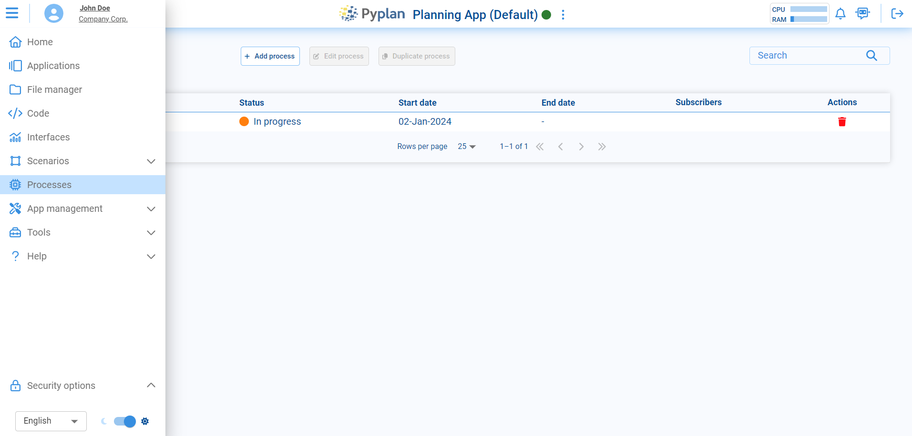
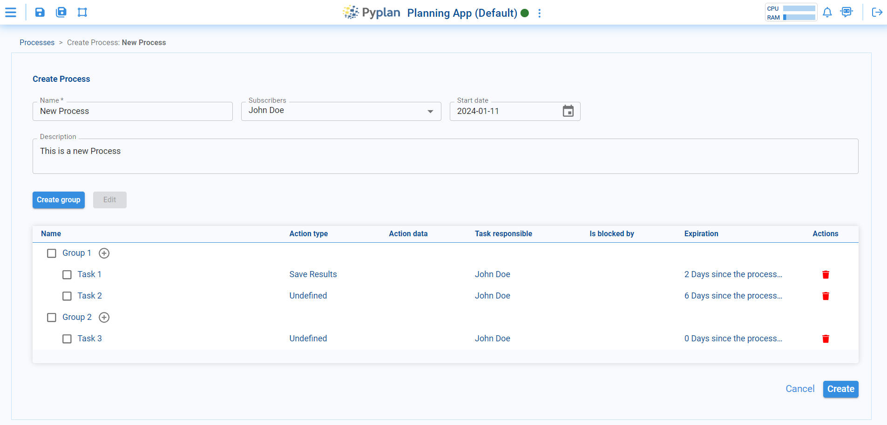
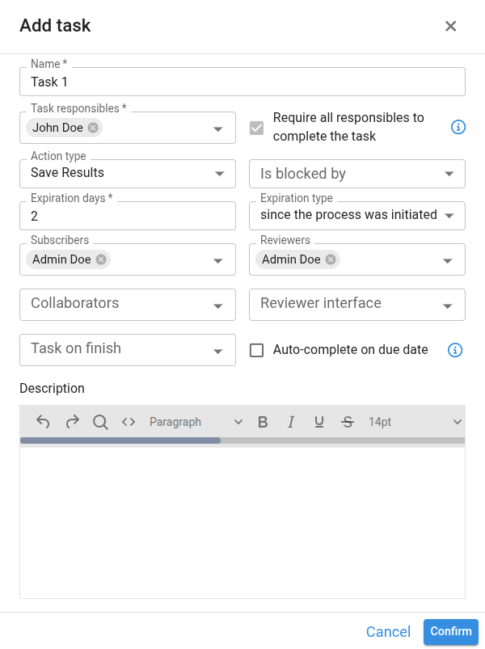
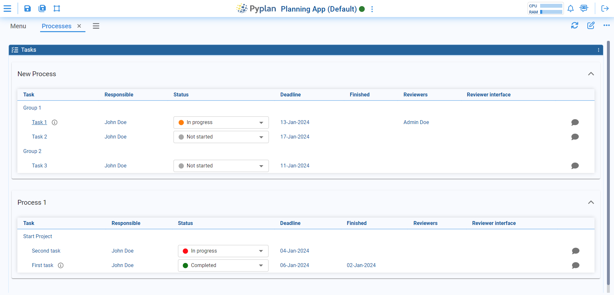

# Processes

The Processes section allows users to create and manage the processes of application creation. A process is a sequence of logical steps that people need to follow to complete a particular task or project. Users can utilize these processes to organize and track projects.

The Processes manager provides an intuitive and user-friendly interface for creating and managing processes, task groups, and individual tasks. Users can create new processes, add task groups, and assign tasks to the corresponding users. They can also designate appropriate reviewers to ensure the quality of work performed in each task.

This section of Pyplan is essential for maintaining a clear and organized record of the steps followed in application creation. It allows better collaboration among team members, defines clear responsibilities, and facilitates the review and validation of each completed task.

## Create a Process

Clicking the **Add Process** button at the top opens the window for creating a new process. Here, you can define the Name, subscribers, Start Date, and include a description for the process. Beneath these details, an option is available to systematically create and organize tasks into groups, aligning with various components or stages of the process.

## Tasks

Processes consist of **Task Groups** which are sets of related tasks. Task groups enable the grouping of closely related tasks or tasks that need to be completed in a certain sequence. This makes it easier to organize and efficiently assign tasks to responsible users.

Each task in a task group can be assigned to a specific user, which permits clear and defined responsibilities. The user assigned to a task is responsible for completing it adequately and within the stipulated time. Moreover, each task can have a designated Reviewer responsible for controlling and checking the work done on the task to ensure it is resolved correctly.

Creating tasks within a process provides a way to divide work into smaller units and assign specific responsibilities to system users. When creating a task, various options can be specified:

- **Name**: A descriptive name to uniquely identify the task within the process.
- **Task responsibles**: Selects the users who will be responsible for completing the task.
- **Require all responsibles to complete the task**: All responsibles must complete the task before it can be marked as completed. If unchecked, only one responsible is required.
- **Action type**: Defines the type of action that needs to be performed in this task.
- **Blocked by**: If this task depends on another previous task to be carried out, it can be specified here. This means the current task can only be undertaken once the mentioned task is complete.
- **Expiration days**: Specify the number of days available to complete the task.
- **Expiration type**: Determines from what point the expiration days start to count — from the creation of the task or from another relevant event.
- **Subscribers**: Users who will receive notifications about the status of the task.
- **Reviewers**: Users in charge of checking and approving the task once it is completed.
- **Reviewer interface**: Interface that reviewers can open and use to evaluate task compliance.
- **Collaborators**: Users who, like the Task Responsible, can complete the task and change its status.
- **Task on finish**: Scheduled task to execute when the task is completed.
- **Auto-complete on due date**: Automatically mark task as completed when due date is reached.
- **Description**: Space for writing a more detailed description of the task, including additional instructions, requirements, or any other relevant information.

## Workflow Interaction

After creating processes, the respective responsible parties for each task can access an interface to view and manage their assigned tasks. Each task is associated with a status, which could be one of the following: **Not Ready to Start**, **Not Started**, **In Progress**, **Pending Review**, **Expired**, or **Completed**.

The task's status reflects its position in the process, and if there are designated reviewers, they can assess whether the task is completed correctly. Additionally, a comments section is available for each task, facilitating communication and providing a space for necessary annotations.

