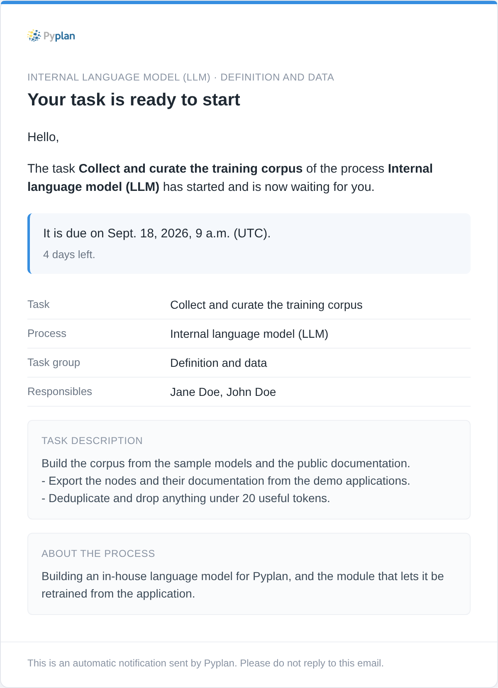
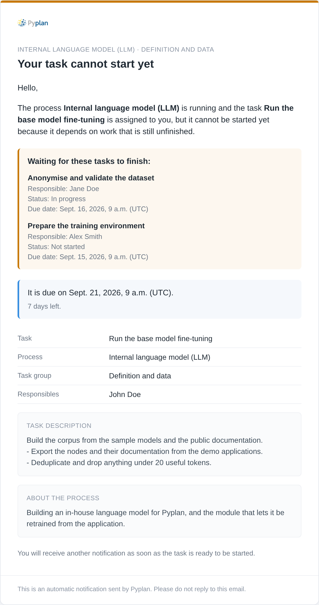
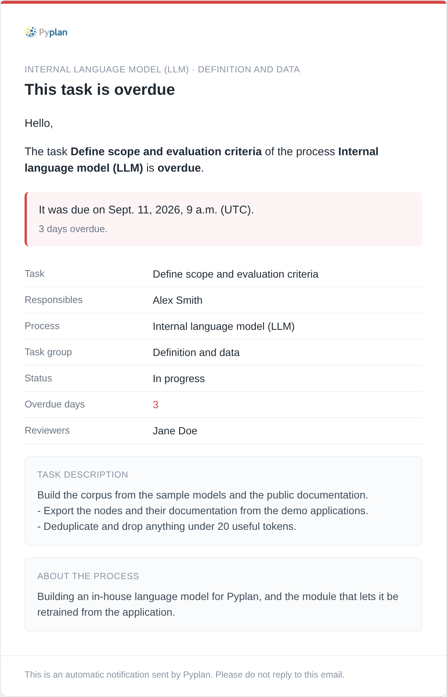

# Processes

The Processes section allows users to create and manage the processes of application creation. A process is a sequence of logical steps that people need to follow to complete a particular task or project. Users can utilize these processes to organize and track projects.

The Processes manager provides an intuitive and user-friendly interface for creating and managing processes, task groups, and individual tasks. Users can create new processes, add task groups, and assign tasks to the corresponding users. They can also designate appropriate reviewers to ensure the quality of work performed in each task.

This section of Pyplan is essential for maintaining a clear and organized record of the steps followed in application creation. It allows better collaboration among team members, defines clear responsibilities, and facilitates the review and validation of each completed task.


## Create a Process

Clicking the **Add Process** button at the top opens the window for creating a new process. Here, you can define the Name, subscribers, Start Date, and include a description for the process. Beneath these details, an option is available to systematically create and organize tasks into groups, aligning with various components or stages of the process.


## Tasks

Processes consist of **Task Groups** which are sets of related tasks. Task groups enable the grouping of closely related tasks or tasks that need to be completed in a certain sequence. This makes it easier to organize and efficiently assign tasks to responsible users.

Each task in a task group can be assigned to a specific user, which permits clear and defined responsibilities. The user assigned to a task is responsible for completing it adequately and within the stipulated time. Moreover, each task can have a designated Reviewer responsible for controlling and checking the work done on the task to ensure it is resolved correctly.

Creating tasks within a process provides a way to divide work into smaller units and assign specific responsibilities to system users. When creating a task, various options can be specified:

- **Name**: A descriptive name to uniquely identify the task within the process.
- **Task responsibles**: Selects the users who will be responsible for completing the task.
- **Require all responsibles to complete the task**: All responsibles must complete the task before it can be marked as completed. If unchecked, only one responsible is required.
- **Action type**: Defines the type of action that needs to be performed in this task.
- **Blocked by**: If this task depends on another previous task to be carried out, it can be specified here. This means the current task can only be undertaken once the mentioned task is complete.
- **Expiration days**: Specify the number of days available to complete the task.
- **Expiration type**: Determines from what point the expiration days start to count — from the creation of the task or from another relevant event.
- **Subscribers**: Users who will receive notifications about the status of the task.
- **Reviewers**: Users in charge of checking and approving the task once it is completed.
- **Reviewer interface**: Interface that reviewers can open and use to evaluate task compliance.
- **Collaborators**: Users who, like the Task Responsible, can complete the task and change its status.
- **Task on finish**: Scheduled task to execute when the task is completed.
- **Auto-complete on due date**: Automatically mark task as completed when due date is reached.
- **Description**: Space for writing a more detailed description of the task, including additional instructions, requirements, or any other relevant information.


## Workflow Interaction

After creating processes, the respective responsible parties for each task can access an interface to view and manage their assigned tasks. Each task is associated with a status, which could be one of the following: **Not Ready to Start**, **Not Started**, **In Progress**, **Pending Review**, **Expired**, or **Completed**.

The task's status reflects its position in the process, and if there are designated reviewers, they can assess whether the task is completed correctly. Additionally, a comments section is available for each task, facilitating communication and providing a space for necessary annotations.


## Email Notifications

Besides the in-app notifications, Pyplan sends emails as a process advances. Who receives each one depends on the role the user has on the task or the process:

| Email | Sent when | Recipients |
| --- | --- | --- |
| **Process started** | The process reaches its start date, or somebody starts it manually. | Process subscribers. |
| **Task ready to start** | The process starts, or the last blocking task is completed or expires — in both cases only for tasks that nothing is holding up any more. | Task responsibles. |
| **Task waiting for a blocking task** | The same moments as above, but for a task that still cannot start because another task has not finished. | Task responsibles. |
| **The status of a task has changed** | A task moves to *In progress*, *Pending review*, back to *In progress* from review, *Completed* or *Expired*. | Task subscribers, plus responsibles and/or reviewers depending on the transition. |
| **Delayed task notification** | The task passes its due date. Sent on days 1, 2, 3, 4, 10, 20 and 30 of delay, not every day. | Responsibles, reviewers, task subscribers and process subscribers — and, separately, the responsibles of the tasks that this one is blocking. |
| **Process up to date** | The last overdue task of a delayed process is cleared. | Process subscribers. |
| **New comment in a task** | Somebody comments on a task. | Responsibles, subscribers and reviewers, except the author of the comment. |

### What the emails tell you

Every task email identifies the process and the task group it belongs to, its responsibles, the **description of the task** and the **description of the process** — so the message is readable on its own, without opening the app to remember what the work is about. Both descriptions are optional; an empty one is simply left out.

- **Due dates, not just counters.** Emails state the exact date and time a task is due — "It is due on September 9, 2026, 2:30 p.m. (UTC) — 5 days left" — and "It was due on September 1, 2026, 2:30 p.m. (UTC) — 3 days overdue" when it is late. Dates are always in **UTC** and the emails say so.
- **Under a day left, emails count hours instead of naming a date.** A message that says "you have until September 4" is misleading when it arrives *on* September 4. So when less than 24 hours remain the email leads with "It is due in 7 hours" (or "in less than an hour"), and gives the exact moment underneath. The same applies just after the deadline: "It was due 3 hours ago".
- **Due dates are projected for tasks that have not started.** For a task whose expiration is counted *since the blocking task was completed*, the date is estimated from the deadlines of the tasks it is waiting on, so a due date is available even before the task can start.


- **A task that cannot start says so, and says why.** When a task is assigned to you but is waiting on another task, you get an email listing each blocking task with its status, its due date, and **who is responsible for it** — instead of silence until the blocker finishes, or a "ready to start" message for a task you cannot touch. The same block appears in the overdue email of a task that is late because it is blocked.


- **If a task you depend on is late**, you get an email that names the blocking task, its responsibles, and the due date of *your own* task, so it is clear whose delay it is.


- **Completed and expired tasks drop the deadline.** The status-change email for a task that reached a final status does not show a countdown, since there is nothing left to do by that date.

### Configuration

Workflow emails follow the company's **Email Settings** preferences, described in [Security Options](./security-options.md#email-settings):

- `email_language` sets the language of every email (`en`, `es` or `pt`), including the format of the dates.
- The **Email logo** uploaded for the company in the Company Manager replaces the Pyplan logo in every email. It is set separately from the company logo shown in the application — see [When the logo does not appear](./security-options.md#when-the-logo-does-not-appear) if it does not show up.
- `email_service_active` turns email sending off entirely for the company.

:::note
These settings are taken from the company that **owns the process**, which is the company you were working in when you created it — not from the company of each recipient. A process created in company A sends its emails with A's language and A's logo to everybody on it.
:::

The check that detects delayed tasks and queues the overdue notifications runs once a day, at the hour set by the `workflow_check_time` company preference (an hour of the day in UTC, `4` by default):

```json
{
  "hour": 4
}
```

Emails are not sent the instant they are generated: they are placed in a queue that a background job drains every few minutes, so expect a short delay between the event and the message arriving.
