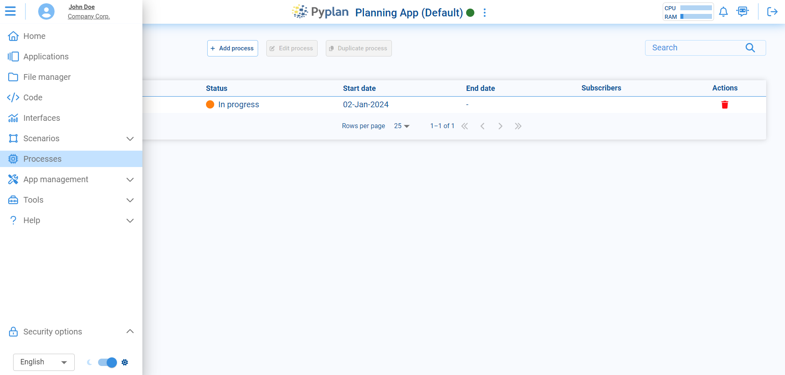
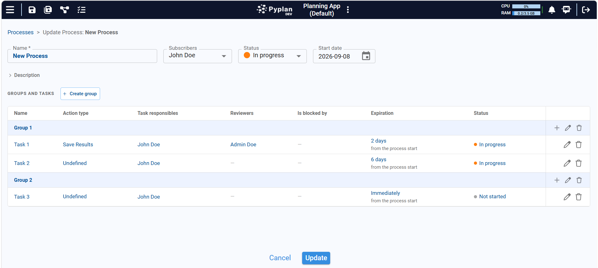
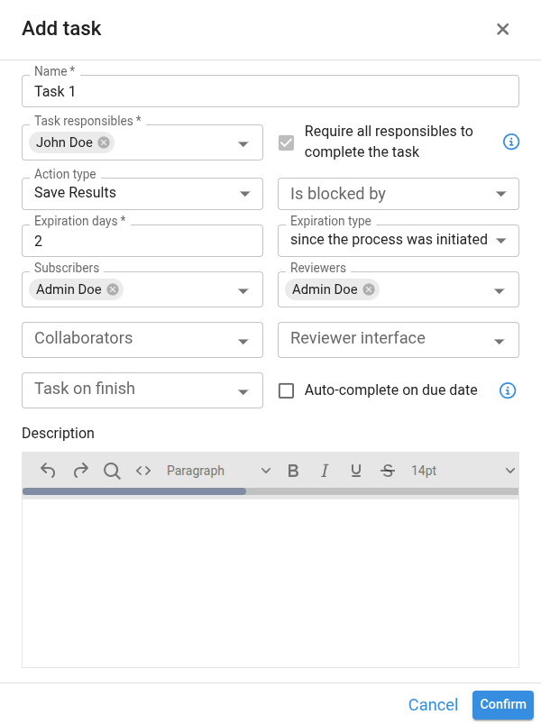
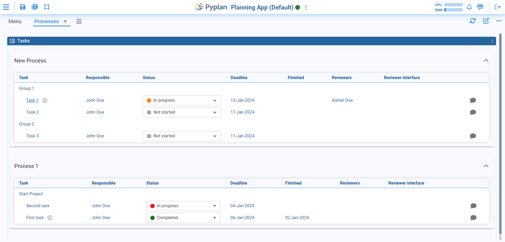

# Processes

The Processes section allows users to create and manage the processes of application creation. A process is a sequence of logical steps that people need to follow to complete a particular task or project. Users can utilize these processes to organize and track projects.

The Processes manager provides an intuitive and user-friendly interface for creating and managing processes, task groups, and individual tasks. Users can create new processes, add task groups, and assign tasks to the corresponding users. They can also designate appropriate reviewers to ensure the quality of work performed in each task.

This section of Pyplan is essential for maintaining a clear and organized record of the steps followed in application creation. It allows better collaboration among team members, defines clear responsibilities, and facilitates the review and validation of each completed task.

## Create a Process

Clicking the **Add Process** button at the top opens the window for creating a new process. Here, you can define the Name, subscribers, Start Date, and include a description for the process. Beneath these details, an option is available to systematically create and organize tasks into groups, aligning with various components or stages of the process.

## Tasks

Processes consist of **Task Groups** which are sets of related tasks. Task groups enable the grouping of closely related tasks or tasks that need to be completed in a certain sequence. This makes it easier to organize and efficiently assign tasks to responsible users.

Each task in a task group can be assigned to a specific user, which permits clear and defined responsibilities. The user assigned to a task is responsible for completing it adequately and within the stipulated time. Moreover, each task can have a designated Reviewer responsible for controlling and checking the work done on the task to ensure it is resolved correctly.

Creating tasks within a process provides a way to divide work into smaller units and assign specific responsibilities to system users. When creating a task, various options can be specified:

- **Name**: A descriptive name to uniquely identify the task within the process.
- **Task responsibles**: Selects the users who will be responsible for completing the task. The list contains both people and agents (see [Agents in a process](#agents-in-a-process) below).
- **Require all responsibles to complete the task**: All responsibles must complete the task before it can be marked as completed. If unchecked, only one responsible is required.
- **Action type**: Defines the type of action that needs to be performed in this task.
- **Blocked by**: If this task depends on another previous task to be carried out, it can be specified here. This means the current task can only be undertaken once the mentioned task is complete.
- **Expiration days**: Specify the number of days available to complete the task.
- **Expiration type**: Determines from what point the expiration days start to count — from the creation of the task or from another relevant event.
- **Subscribers**: Users who will receive notifications about the status of the task.
- **Reviewers**: Users in charge of checking and approving the task once it is completed. An agent can review just as a person can.
- **Reviewer interface**: Interface that reviewers can open and use to evaluate task compliance.
- **Collaborators**: Users who, like the Task Responsible, can complete the task and change its status.
- **Task on finish**: Scheduled task to execute when the task is completed.
- **Auto-complete on due date**: Automatically mark task as completed when due date is reached.
- **Description**: Space for writing a more detailed description of the task, including additional instructions, requirements, or any other relevant information.

## Agents in a Process

A task can be carried out — or reviewed — by an **agent** instead of a person. In *Task responsibles* and *Reviewers* the agents of the application appear beside the people, grouped under **Agents**: you pick the agent that does the work, exactly as you would pick a colleague. Nothing has to be declared inside the application itself.

Pick an agent and one more field appears: **Run as**. That is the *agent user* whose permissions the run gets — its roles, its departments, what it can see. An agent user is created from the User manager with the **This user is an agent** checkbox: it consumes a license seat and it cannot sign in (it has no password). One agent user normally serves every agent in the company, so the field fills itself in and you only touch it when there is more than one identity to choose from.

**Several agents can share one identity, and can be on the same task.** Two agents reviewing the same step — say a risk one and a finance one — is one task with two reviewers, both running as the same agent user.

Two more fields appear with an agent on the task: **Application** and **Version**, which say what the agent opens. They default to the application the process belongs to, and to *Default version* — meaning whichever version is the default **when the run happens**, not the one that is the default today. Pick a version by name only when the task has to stay on that exact version.

### What the agent does

When the task becomes workable, the agent opens the application with its own permissions, reads the task (its description, deadline, previous comments and the tasks it was waiting for), does the work, and reports back. Its report becomes a comment on the task, so the thread reads the same whether a person or an agent worked on it.

**One run leaves one comment.** Whatever the agent reports — its summary and any note it decided to add along the way — is written as a single entry, so a task never shows the same run twice. There is no need to ask a task for a comment: what the agent reports is already the comment. Ask for the analysis, and the analysis is what gets written.

While a run is in flight, the agent badge next to the responsible's name turns into a spinner, in the process manager and in *My tasks* alike.

An agent can also fail to resolve a task. When that happens it says so in a comment and the task is left for a person: the usual delay and expiration rules take over from there, exactly as with somebody who did not answer.

### Who closes the task

The same rule that applies to people: if the task has **reviewers**, whoever executes it can only move it to *Pending review* — the reviewers approve or send it back. If it has no reviewers, the executor can close it. Delegating a task entirely to an agent is simply a task with no reviewers; adding a reviewer is how you keep a person in the loop.

What has to be a second opinion is the **agent**, not the identity it runs as: the same agent user can be behind both sides as long as the reviewing agent is not the one that did the work. Two things are refused: the same agent twice in one role, and the same agent on both sides of the review.

### Sending a task back for changes

A reviewer who is not satisfied moves the task from *Pending review* to **In progress**. Pyplan then asks what has to be corrected, posts it as a comment and reopens the task. If the responsible is an agent, that comment is the instruction for its next run: it starts again on its own and reads the note first.

A comment on its own does not reopen anything — it is the status change that does, which is what separates "this is fine" from "try something else".

### Managing a process by chat

A process can also be built and changed by asking the assistant — or any MCP
client — instead of using this screen: "set up the monthly close and let the S&OP
agent review the consolidation" creates the same process this section would. It
runs with your own permissions: authoring needs the same right the Processes
section requires, and anybody involved in a task can read it, comment on it and
move their own task exactly as they can here. Restarting or deleting a process
is asked for explicitly before it happens.

### Running an agent on demand

Any task with an agent shows a **Run agent** action in *My tasks*. It queues a run immediately instead of waiting for the process to reach the task, which is also how you retry after a failure. While a run is in flight the action shows a spinner and a second run is refused.

:::info
An administrator can switch agents in processes off for the whole company from **AI settings → Availability**. With it off, agents cannot be assigned to tasks and the ones already assigned do not run. The chat is unaffected.
:::

:::warning
When an agent responsible and an agent reviewer disagree, the task bounces between them. Pyplan stops that after three rounds, leaves a comment saying so, and hands the task to a person. The limit only applies when both sides are agents: a person can send work back as many times as it takes.
:::

## Workflow Interaction

After creating processes, the respective responsible parties for each task can access an interface to view and manage their assigned tasks. Each task is associated with a status, which could be one of the following: **Not Ready to Start**, **Not Started**, **In Progress**, **Pending Review**, **Expired**, or **Completed**.

The task's status reflects its position in the process, and if there are designated reviewers, they can assess whether the task is completed correctly. Additionally, a comments section is available for each task, facilitating communication and providing a space for necessary annotations. Tasks assigned to an agent are marked with an agent icon, and the agent's own notes appear in that same comments section.

