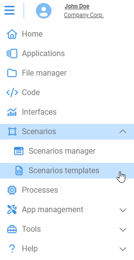
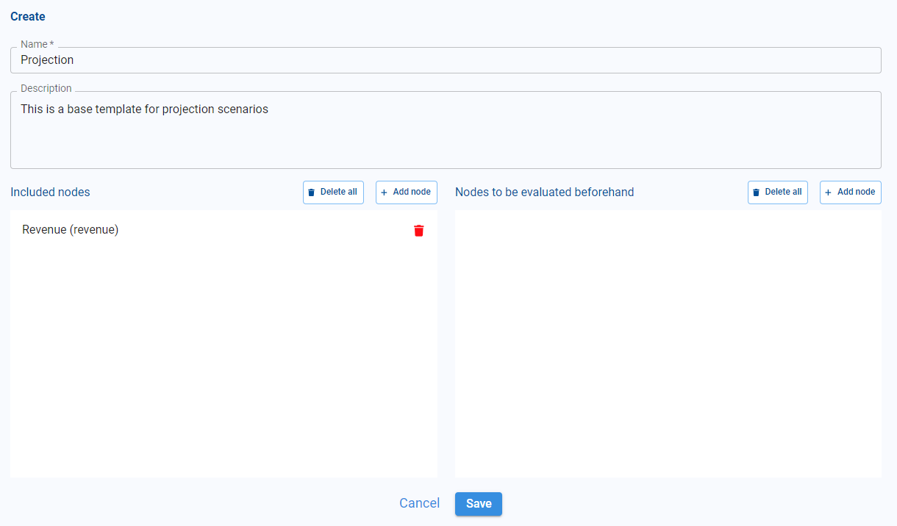
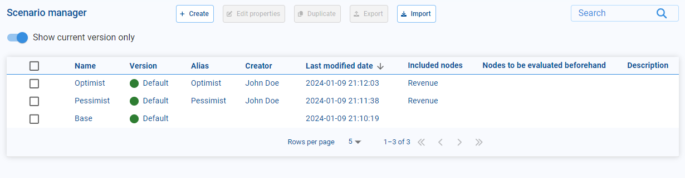
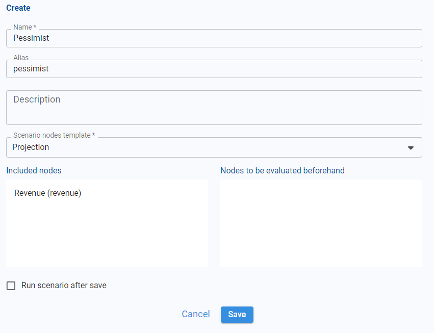
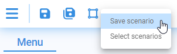
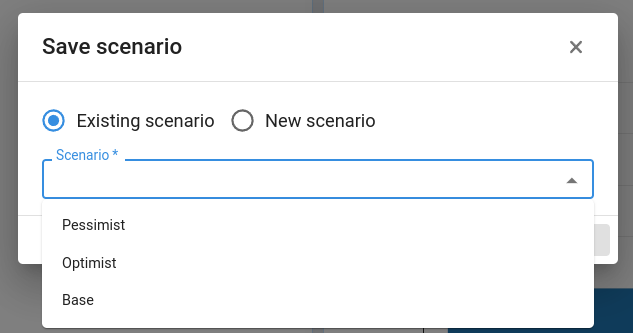
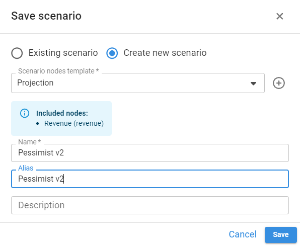
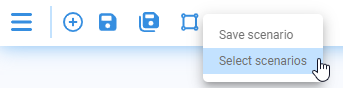
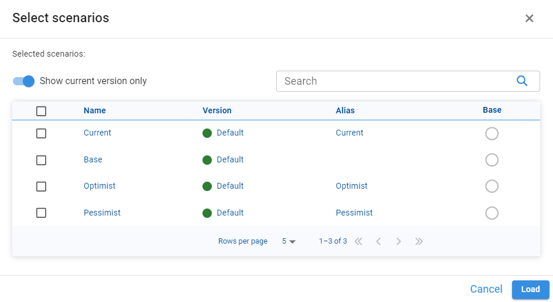
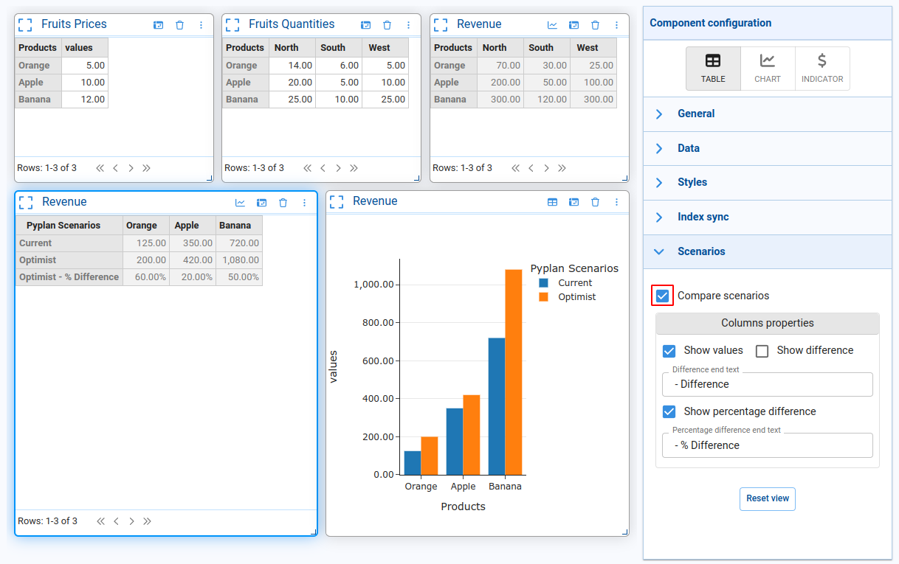

# Scenarios

A scenario consists of a set of results from certain nodes that are stored in order to be used later for comparison. Many scenarios can exist in one version. Pyplan allows the comparison of scenarios even between different versions of the same application.

:::info
In order to compare two or more scenarios, the results to be compared must have the same structure.
:::

Before creating a scenario, it is necessary to define a **Scenario Template**. The scenario template defines which nodes will be included as a result in a scenario.

## Scenario Template

To create a scenario template, click on the menu on the **Scenario templates** option and then on the **Create** button.

The scenario template has the following properties:

- **Name**: name of the template.
- **Description**: description of the template.
- **Included Nodes**: list of nodes that will be included as a result when creating a scenario.
- **Nodes to be evaluated beforehand** (optional): list of nodes that will be evaluated before creating a scenario. For example, consider a situation where a button initiates a process that modifies a node within the scenario, but solely at the disk level — such as retrieving a table and storing it in a `.pkl` file. To avoid the node running this process upon each execution, these nodes are structured to undergo evaluation beforehand.

## Scenario Manager

To access the scenario manager, click on the **Scenarios / Scenarios manager** option in the main menu.

From the administrator you can create, edit, export and import scenarios.

To create a new scenario you must click on the **Create** button. Then a window like the following will open:

Here you must define the name, the alias (used as a label for comparison), an optional description, and you must specify the scenario template on which to base the creation of the scenario.

:::info Clarification
During this step, you define the scenario according to your requirements. Optionally, you can save the scenario results by selecting the **Run scenario after save** checkbox.
:::

## Save Scenario

Once you have defined a scenario (specifying the nodes that will persist), you can save the current scenario or create a new scenario by clicking on the **Save scenario** button.

**If you select "Existing scenario":**

When confirmed, the results of the nodes defined in the selected scenario will be saved, overwriting the previous results.

**If you select "Create new scenario":**

You must specify the scenario template to be taken as a base and assign a name and alias. When confirmed, a new scenario will be created with the results of the nodes that were specified in the selected scenario.

## Scenario Comparison

You can compare different scenarios (even from different versions) by clicking on the **Select scenarios** button:

In the next window you can select the scenarios to be compared, specifying which of these will be used as the basis for the comparison.

For a component (table or graph) to allow scenario comparison, you must enable the comparison option from the component properties:

This option will add a new dimension **"Pyplan Scenarios"** which will contain the list of selected scenarios. You can also specify whether or not to add the calculated difference fields (both absolute and percentage).
