# Security Options

Pyplan provides a comprehensive set of security features for managing users and their permissions. Each user can be assigned access to specific companies and configured with distinct departments and roles, ensuring precise control over what they can view and modify within the platform.

## User Manager

Users, roles, and departments are managed from the **User Manager**, available under **Security options → Users**.

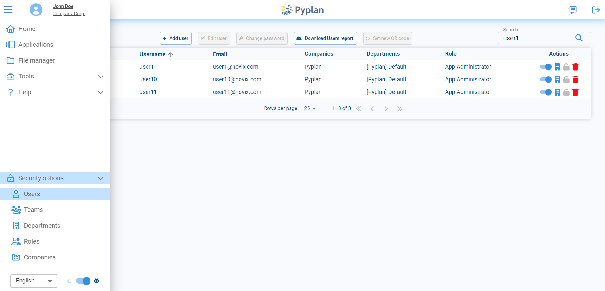

In this section you can:

- View the complete list of users for the selected company.
- Create new users (if you have the required permissions).
- Edit existing user profiles, including their roles and department assignments.

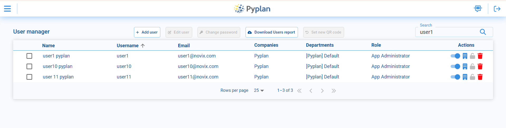

## User Creation

To create a new user, access the **Add user** option in the User Manager.

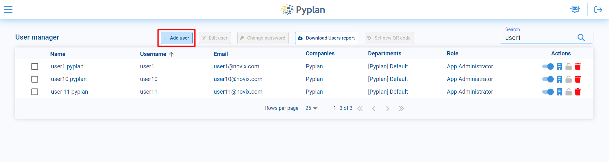

Fill in the required fields: **First Name**, **Last Name**, **Email**, **Username**, and **Password**. Additional options include:
- Require user to change password on login.
- Enable multi-factor authentication.

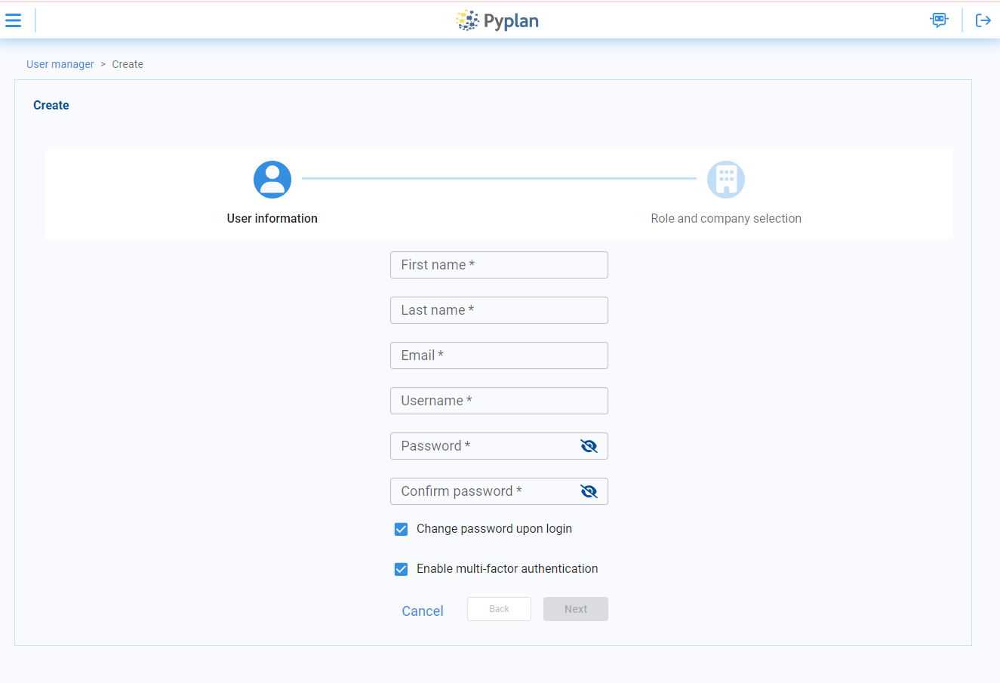

Select the main role for the user. Then choose, for each company you want to assign the user to, the departments and role they belong to.

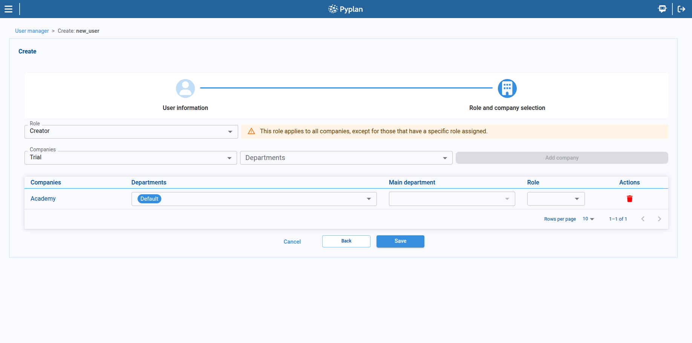

When a user belongs to multiple departments, a **Main Department** must be selected. The Main Department determines which department's resources and defaults are applied first.

:::warning
If a user is assigned to more than one department, a Main Department must be set. If it is not set, the backend will choose one arbitrarily, which may lead to incorrect behavior or unexpected resource assignments.
:::

A user may have a specific role for a given company. If so, when the user logs into that company, all permissions are determined by that specific role. If the user does not have a company-specific role, they will inherit all permissions from their main role.

## Edit Users

To modify existing users from the User Manager:

1. Select the user in the list.
2. Use the **Edit user** option in the toolbar to change profile data, roles, or departments.
3. Use the **Change password** option to update the user's password only.

Changes take effect immediately after saving.

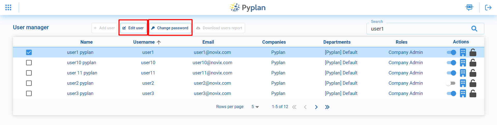

## Roles

A role is a collection of permissions assigned to a user within the platform. Roles can be assigned and customized according to the needs of each organization.

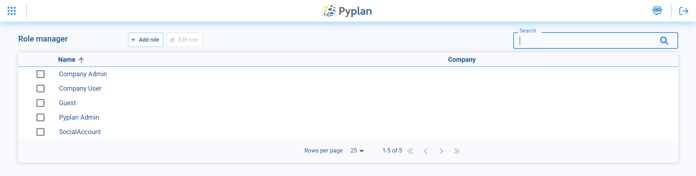

Roles are created by accessing the **Add role** option in the top menu. Select the company to which the role will belong, define the name, and choose one of the templates that has a set of default permissions configured. Permissions can then be modified in the **Permissions by role** option.

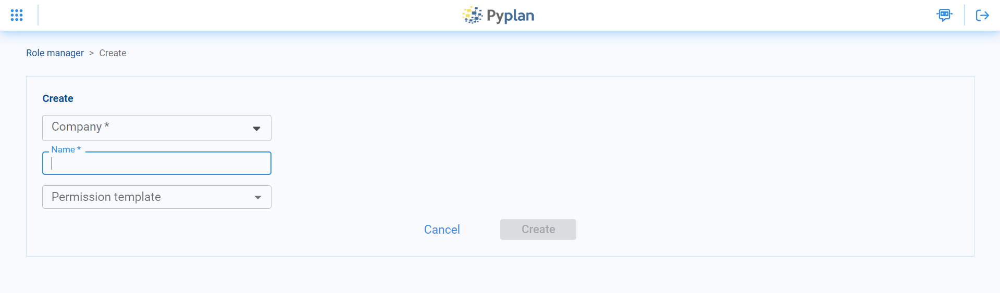

## Permissions by Role

The **Permissions by role** option lets you modify which actions each role can perform.

- Permissions are grouped by module (Applications, Interfaces, File Manager, Workflow, etc.).
- Expanding a group shows detailed permissions.
- For each permission, enable or disable access per role by checking or unchecking the corresponding checkbox.

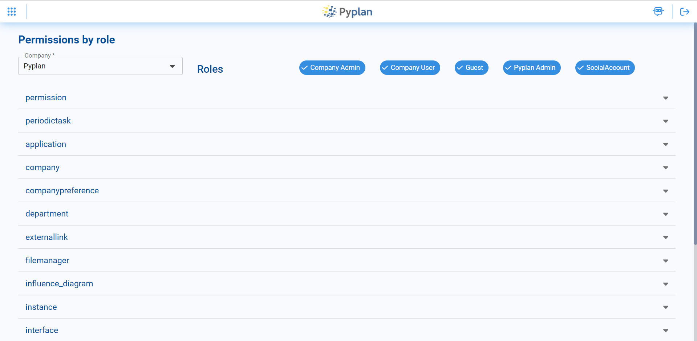

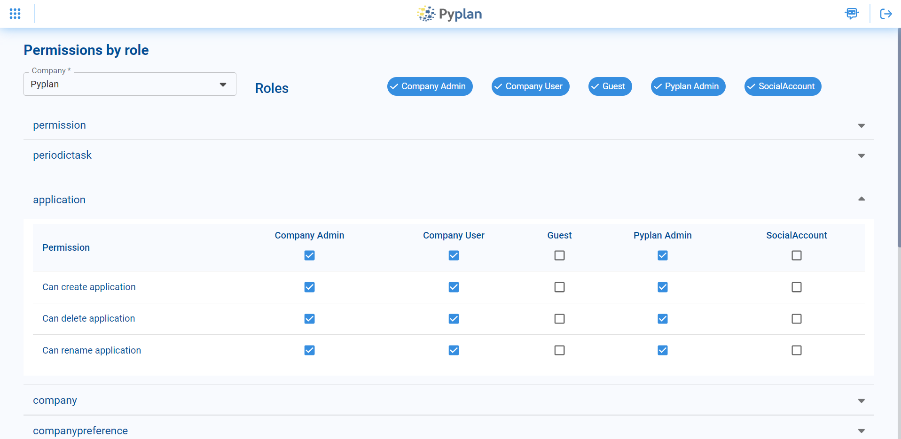

### Default Role Permissions Table

| Module | Permission | Administrator | App Administrator | Creator with Public Access | Creator | Explorer | Viewer | Login Only | Super Admin |
|---|---|:---:|:---:|:---:|:---:|:---:|:---:|:---:|:---:|
| **Applications** | Create apps | ✓ | ✓ | ✓ | ✓ | | | | ✓ |
| | Create versions and scenarios | ✓ | ✓ | ✓ | ✓ | | | | ✓ |
| | View diagram | ✓ | ✓ | ✓ | ✓ | | | | ✓ |
| | Save changes in private space | ✓ | ✓ | ✓ | ✓ | | | | ✓ |
| | Save changes in Public app | ✓ | ✓ | ✓ | | | | | ✓ |
| | Set permissions in diagram modules | ✓ | ✓ | | | | | | ✓ |
| **Interfaces** | View interfaces | ✓ | ✓ | ✓ | ✓ | ✓ | ✓ | | ✓ |
| | Add, modify, or delete interfaces | ✓ | ✓ | ✓ | ✓ | ✓ | | | ✓ |
| | Set interface permissions | ✓ | ✓ | | | | | | ✓ |
| **File Manager** | View File Manager | ✓ | ✓ | ✓ | ✓ | | | | ✓ |
| | Add/modify/delete files (private) | ✓ | ✓ | ✓ | ✓ | | | | ✓ |
| | Add/modify/delete files (Public) | ✓ | ✓ | ✓ | | | | | ✓ |
| | Set permissions on files/folders | ✓ | ✓ | | | | | | ✓ |
| **External Links** | Create/modify/delete API endpoints or interface links | ✓ | ✓ | ✓ | ✓ | | | | ✓ |
| **Workflow** | Manage processes | ✓ | ✓ | | | | | | ✓ |
| **Scheduled Tasks** | Create/modify/delete scheduled tasks | ✓ | ✓ | ✓ | ✓ | | | | ✓ |
| **Teams** | Add/modify/delete Teams | ✓ | ✓ | | | | | | ✓ |
| **Departments** | Add/modify/delete departments | ✓ | ✓ | | | | | | ✓ |
| **Instances** | View company instances | ✓ | ✓ | | | | | | ✓ |
| | Deactivate company instances | ✓ | ✓ | | | | | | ✓ |
| **Roles** | Create/modify/delete roles | | | | | | | | ✓ |
| **Companies** | Create companies | | | | | | | | ✓ |
| | Modify companies | ✓ | | | | | | | ✓ |
| **General Settings** | Modify General Settings | ✓ | | | | | | | ✓ |

## Departments

Departments control access to data and resources at an organizational level. They can:

- Restrict access to specific folders in the File Manager.
- Restrict access to certain interfaces or modules.
- Define the hardware specifications for the instances used by their members.

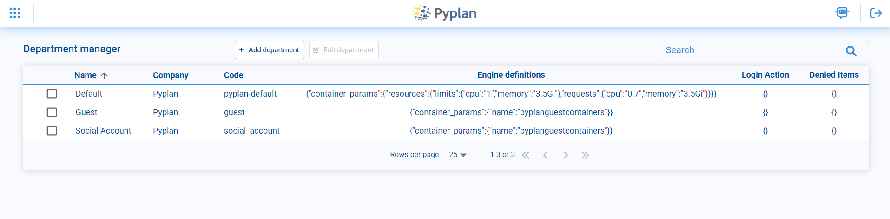

From the Department Manager you can view existing departments, edit them, or create new ones using **Add department**, where you specify:
- Department name.
- Company it belongs to.
- Resources.

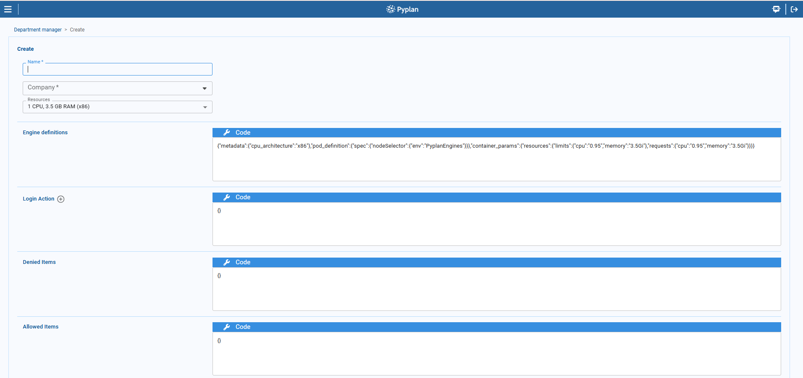

## Teams

Teams allow you to group users within a company so they can share applications and files only with other members of that Team. Each Team has its own folder in the File Manager (under the Teams folder), accessible only by Team members.

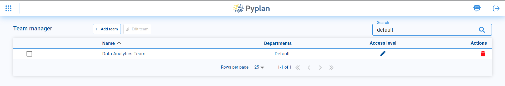

From the Team Manager you can view existing teams or add new ones. For each team you define:
- The name of the Team.
- Which departments have access and with which level: **Read-only** or **Read/Write**.

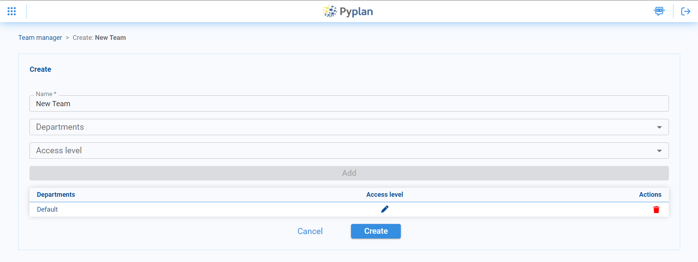

## Companies

In Pyplan, each company defines an isolated environment where its users can work together and share files and applications. From the Company Manager you can create new companies and edit existing ones.

When creating a new company, define:
- The company name.
- The folder name where all files belonging to that company will be stored.

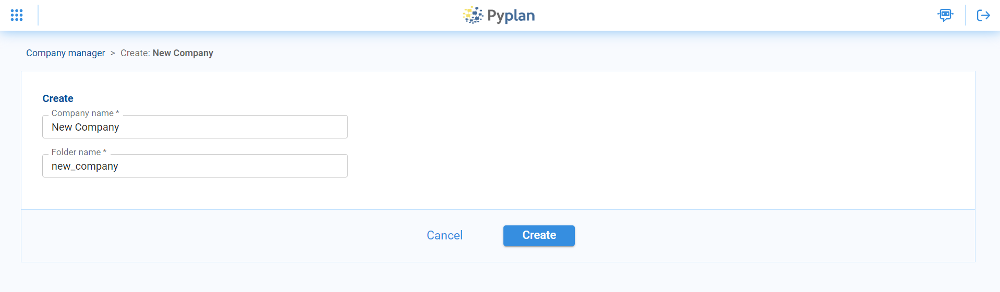

To activate a new company, assign a Pyplan license, which determines:
- For how long the company is enabled.
- The maximum number of users allowed.

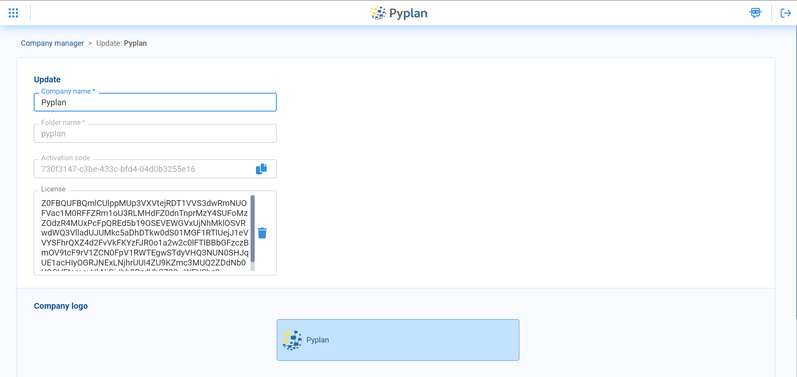

Manage company-level preferences by selecting a company and clicking the **Preferences** button.

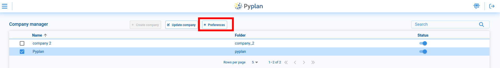

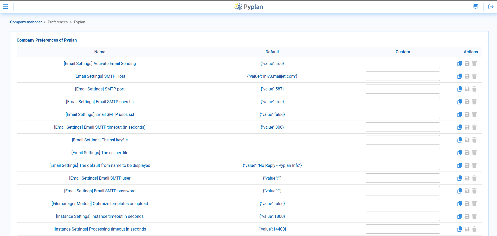

### Single Sign-On (SSO) with SAML

To enable SSO with SAML, add a preference called **SAML Configuration** with the following JSON structure:

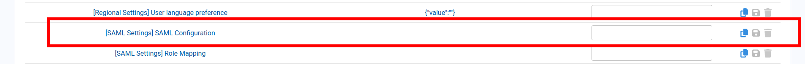

```json
{
  "groups": ["Name of Group"],
  "definition": {
    "service": {
      "sp": {
        "idp": { ... },
        "single_sign_on_service": { ... }
      },
      "name": "Company name",
      "endpoints": { ... }
    },
    "entityid": "string",
    "metadata": { ... }
  },
  "departments": ["departmentCode"],
  "main_department": "string"
}
```

Key fields:
- **groups**: Roles to assign to the user when created. Values must match existing role names in Pyplan.
- **definition**: JSON containing all SAML configuration details (company name, IdP information, connection metadata, etc.).
- **departments**: Department codes to assign to the user when created.
- **main_department**: Main department code for resource usage.

### Role Mapping

To define default roles and departments based on values from Active Directory, add a preference called **Role Mapping**:

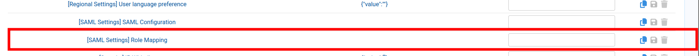

```json
{
    "role": {
        "ManagerFromActiveDirectory": "Administrator",
        "CustomUserActiveDirectory": "Creator"
    },
    "department": {
        "SalesActiveDirectory": ["pyplan-default", "guest"],
        "InvitedActiveDirectory": "guest"
    }
}
```

## Grant/Deny Access to Information

In Pyplan, you can manage access permissions to specific items — such as folders, modules, and interfaces — per department. This allows, for example, departments like Accounting and HR to have different visibility and access within the same application.

### How it works

For each department you can either allow or deny access to selected items:
- If an item is in the **allowed list**, the department can access it.
- If an item is in the **denied list**, the department cannot access it.

Pyplan automatically resolves conflicts:
- If an item is added to the allowed list, it is removed from the denied list.
- If an item is added to the denied list, it is removed from the allowed list.

### What you can control

For each department you can manage access to:
- Interfaces and interface folders
- Folders in the File Manager
- Modules in the influence diagram

### Example 1: Configuring permissions for interfaces

From the Interface Manager:

1. Select one or more interfaces whose access you want to change.
2. Open the permissions dialog.

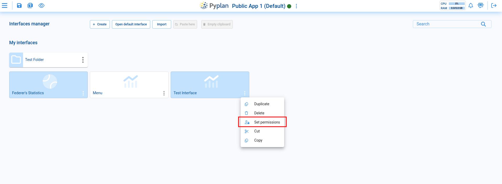

The dialog lets you choose between:
- **Deny access** to selected departments, or
- **Allow access only** to selected departments.

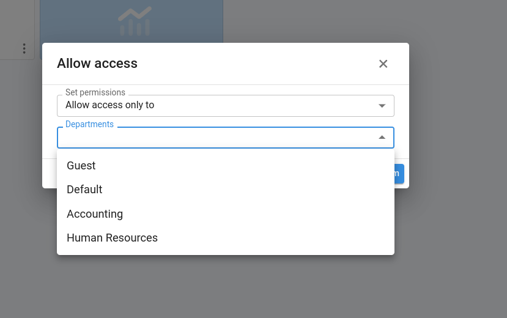

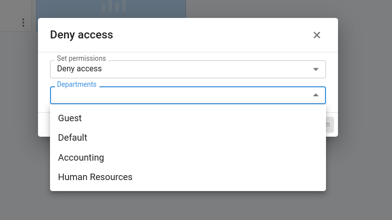

After applying the change, the interface shows a padlock icon to indicate restricted access.

### Example 2: Configuring permissions in the File Manager

In the File Manager, you can restrict one folder at a time:

1. Navigate to the folder you want to restrict.
2. Open its options menu.
3. Use the same permissions dialog.

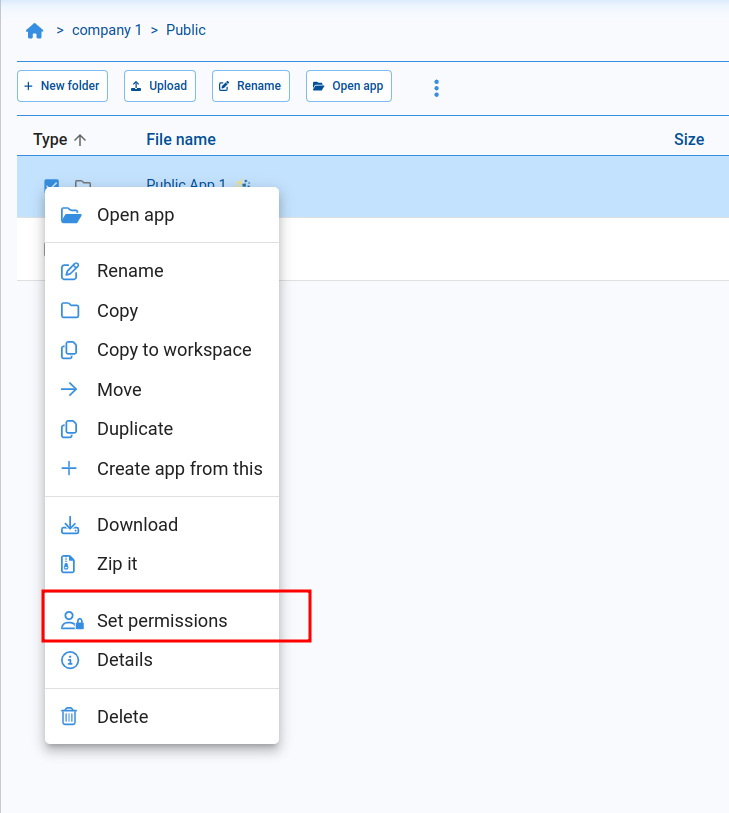

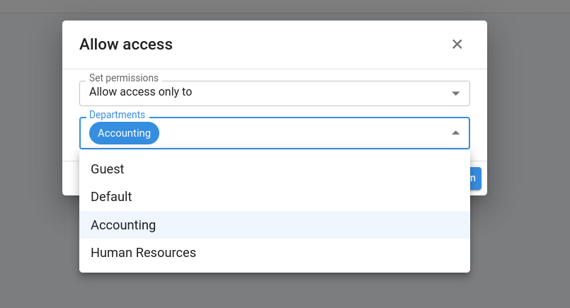

### Example 3: Configuring permissions for modules

To restrict access to diagram modules:

1. Select one or more modules in the influence diagram.
2. Right-click to open the context menu.

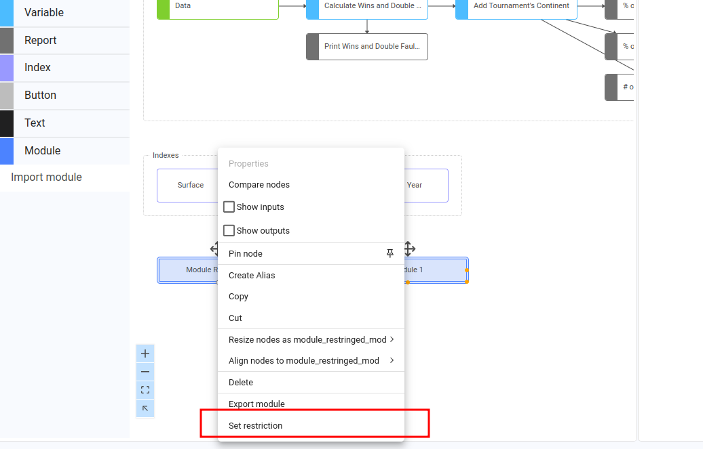

The dialog lets you choose between Deny or Allow access to selected departments.

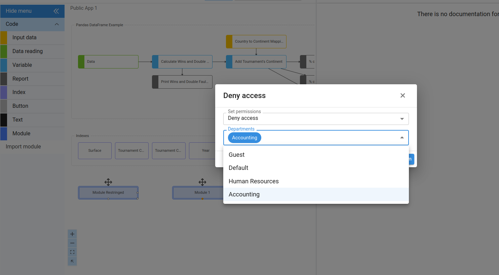

When access to a module is denied for a department, users from that department will not see those modules when opening the diagram.
