# Security Options

Pyplan provides a comprehensive set of security features for managing users and their permissions. Each user can be assigned access to specific companies and configured with distinct departments and roles, ensuring precise control over what they can view and modify within the platform.

## User Manager

Users, roles, and departments are managed from the **User Manager**, available under **Security options → Users**.

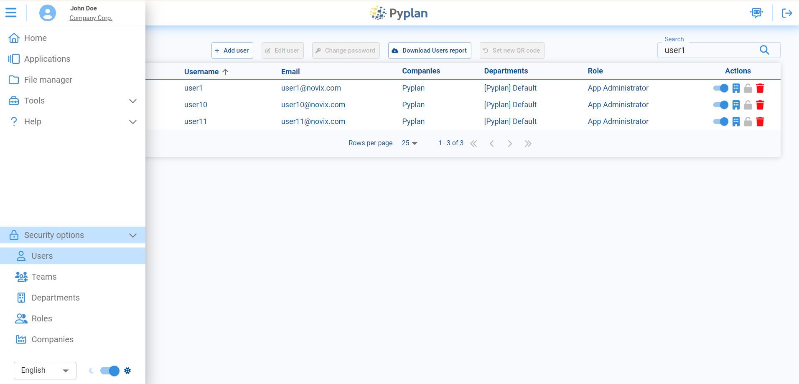

In this section you can:

- View the complete list of users for the selected company.
- Create new users (if you have the required permissions).
- Edit existing user profiles, including their roles and department assignments.

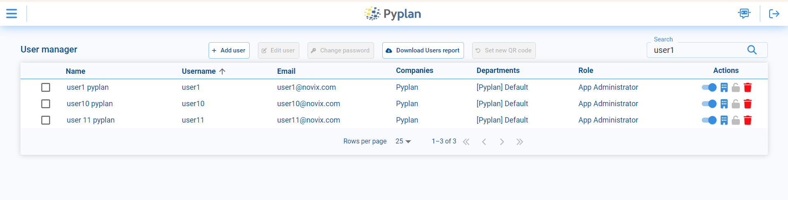

## User Creation

To create a new user, access the **Add user** option in the User Manager.

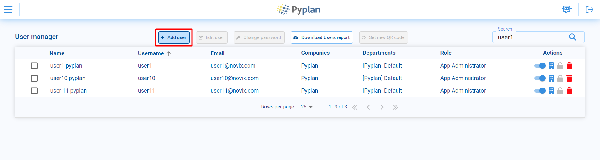

Fill in the required fields: **First Name**, **Last Name**, **Email**, **Username**, and **Password**. Additional options include:
- Require user to change password on login.
- Enable multi-factor authentication.

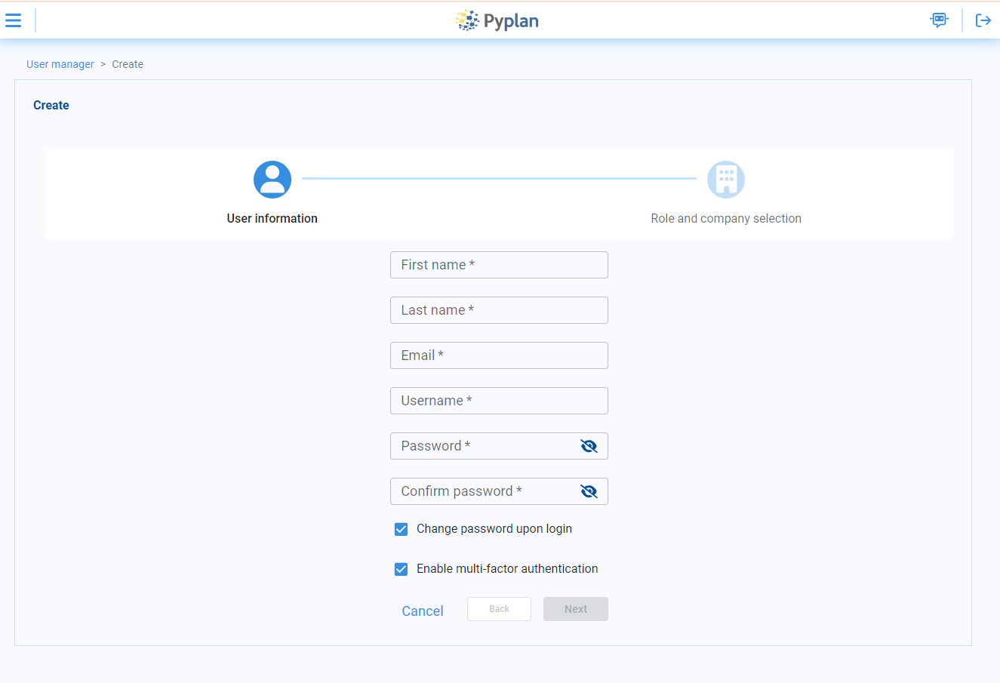

Select the main role for the user. Then choose, for each company you want to assign the user to, the departments and role they belong to.

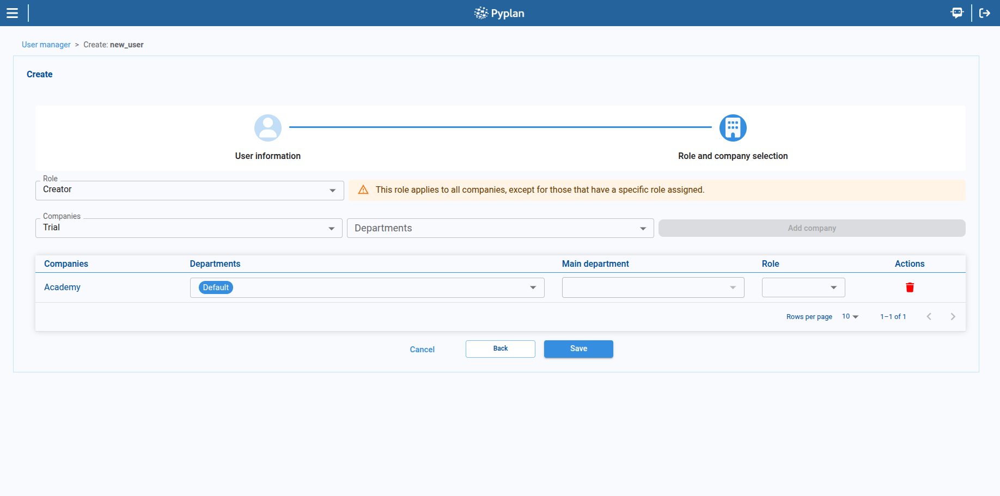

When a user belongs to multiple departments, a **Main Department** must be selected. The Main Department determines which department's resources and defaults are applied first.

:::warning
If a user is assigned to more than one department, a Main Department must be set. If it is not set, the backend will choose one arbitrarily, which may lead to incorrect behavior or unexpected resource assignments.
:::

A user may have a specific role for a given company. If so, when the user logs into that company, all permissions are determined by that specific role. If the user does not have a company-specific role, they will inherit all permissions from their main role.

## Edit Users

To modify existing users from the User Manager:

1. Select the user in the list.
2. Use the **Edit user** option in the toolbar to change profile data, roles, or departments.
3. Use the **Change password** option to update the user's password only.

Changes take effect immediately after saving.

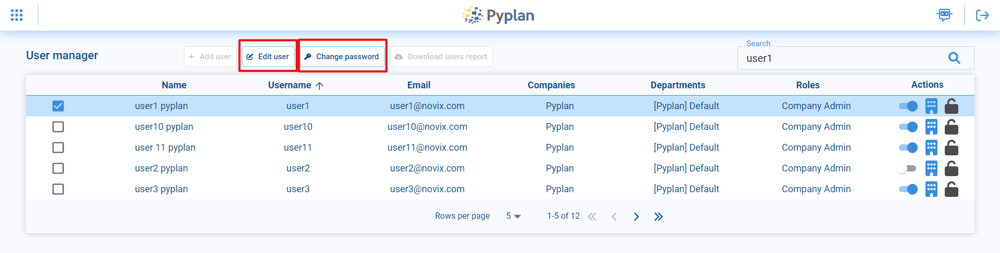

## Roles

A role is a collection of permissions assigned to a user within the platform. Roles can be assigned and customized according to the needs of each organization.

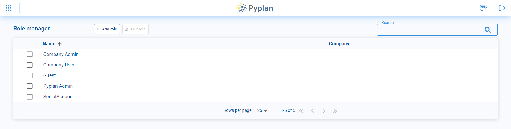

Roles are created by accessing the **Add role** option in the top menu. Select the company to which the role will belong, define the name, and choose one of the templates that has a set of default permissions configured. Permissions can then be modified in the **Permissions by role** option.

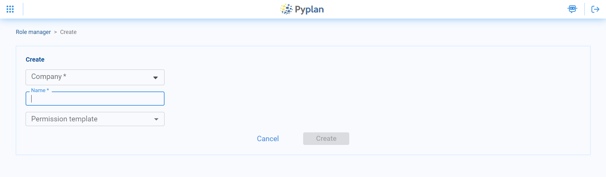

## Permissions by Role

The **Permissions by role** option lets you modify which actions each role can perform.

- Permissions are grouped by module (Applications, Interfaces, File Manager, Workflow, etc.).
- Expanding a group shows detailed permissions.
- For each permission, enable or disable access per role by checking or unchecking the corresponding checkbox.

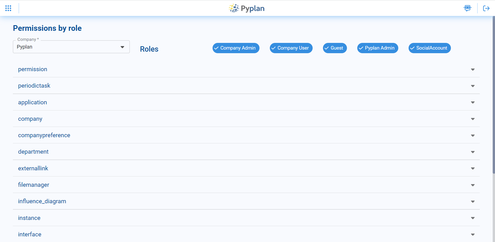

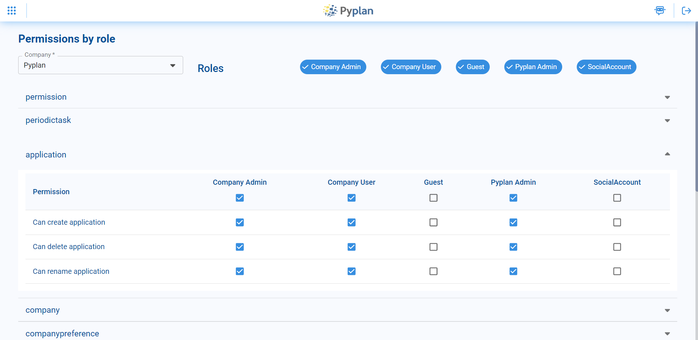

### Default Role Permissions Table

| Module | Permission | Administrator | App Administrator | Creator with Public Access | Creator | Explorer | Viewer | Login Only | Super Admin |
|---|---|:---:|:---:|:---:|:---:|:---:|:---:|:---:|:---:|
| **Applications** | Create apps | ✓ | ✓ | ✓ | ✓ | | | | ✓ |
| | Create versions and scenarios | ✓ | ✓ | ✓ | ✓ | | | | ✓ |
| | View diagram | ✓ | ✓ | ✓ | ✓ | | | | ✓ |
| | Save changes in private space | ✓ | ✓ | ✓ | ✓ | | | | ✓ |
| | Save changes in Public app | ✓ | ✓ | ✓ | | | | | ✓ |
| | Set permissions in diagram modules | ✓ | ✓ | | | | | | ✓ |
| **Interfaces** | View interfaces | ✓ | ✓ | ✓ | ✓ | ✓ | ✓ | | ✓ |
| | Add, modify, or delete interfaces | ✓ | ✓ | ✓ | ✓ | ✓ | | | ✓ |
| | Set interface permissions | ✓ | ✓ | | | | | | ✓ |
| **File Manager** | View File Manager | ✓ | ✓ | ✓ | ✓ | | | | ✓ |
| | Add/modify/delete files (private) | ✓ | ✓ | ✓ | ✓ | | | | ✓ |
| | Add/modify/delete files (Public) | ✓ | ✓ | ✓ | | | | | ✓ |
| | Set permissions on files/folders | ✓ | ✓ | | | | | | ✓ |
| **External Links** | Create/modify/delete API endpoints or interface links | ✓ | ✓ | ✓ | ✓ | | | | ✓ |
| **Workflow** | Manage processes | ✓ | ✓ | | | | | | ✓ |
| **Scheduled Tasks** | Create/modify/delete scheduled tasks | ✓ | ✓ | ✓ | ✓ | | | | ✓ |
| **Teams** | Add/modify/delete Teams | ✓ | ✓ | | | | | | ✓ |
| **Departments** | Add/modify/delete departments | ✓ | ✓ | | | | | | ✓ |
| **Instances** | View company instances | ✓ | ✓ | | | | | | ✓ |
| | Deactivate company instances | ✓ | ✓ | | | | | | ✓ |
| **Roles** | Create/modify/delete roles | | | | | | | | ✓ |
| **Companies** | Create companies | | | | | | | | ✓ |
| | Modify companies | ✓ | | | | | | | ✓ |
| **General Settings** | Modify General Settings | ✓ | | | | | | | ✓ |

## Departments

Departments control access to data and resources at an organizational level. They can:

- Restrict access to specific folders in the File Manager.
- Restrict access to certain interfaces or modules.
- Define the hardware specifications for the instances used by their members.

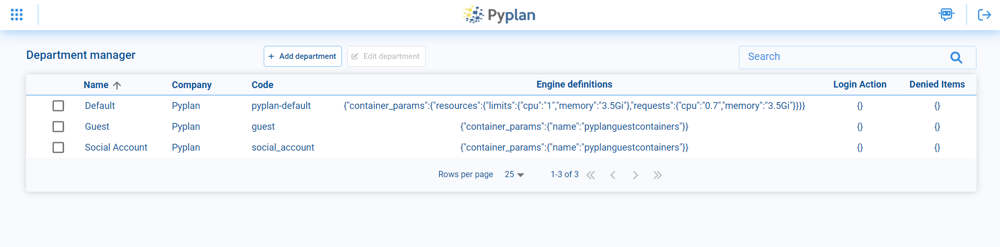

From the Department Manager you can view existing departments, edit them, or create new ones using **Add department**, where you specify:
- Department name.
- Company it belongs to.
- Resources.

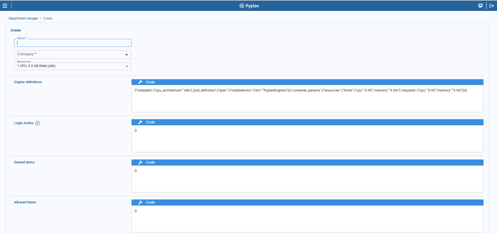

## Teams

Teams allow you to group users within a company so they can share applications and files only with other members of that Team. Each Team has its own folder in the File Manager (under the Teams folder), accessible only by Team members.

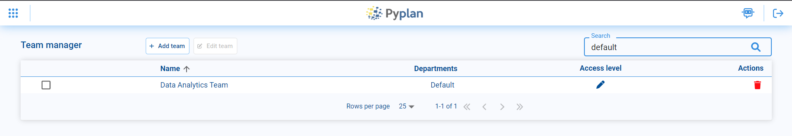

From the Team Manager you can view existing teams or add new ones. For each team you define:
- The name of the Team.
- Which departments have access and with which level: **Read-only** or **Read/Write**.

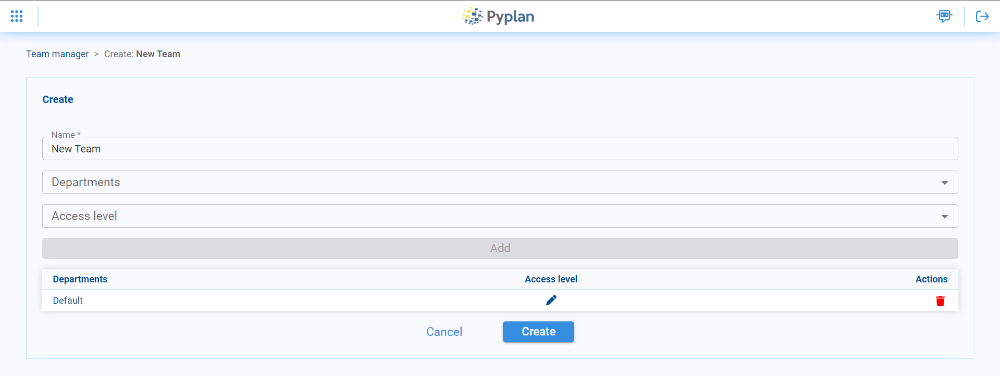

## Companies

In Pyplan, each company defines an isolated environment where its users can work together and share files and applications. From the Company Manager you can create new companies and edit existing ones.

When creating a new company, define:
- The company name.
- The folder name where all files belonging to that company will be stored.

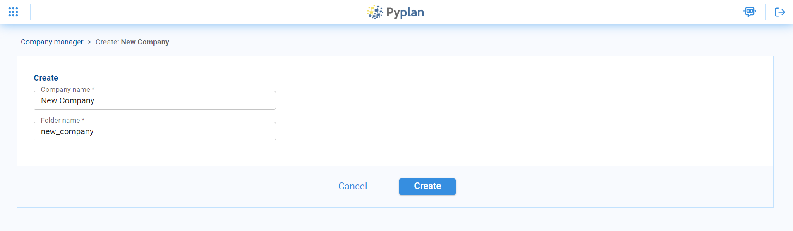

To activate a new company, assign a Pyplan license, which determines:
- For how long the company is enabled.
- The maximum number of users allowed.

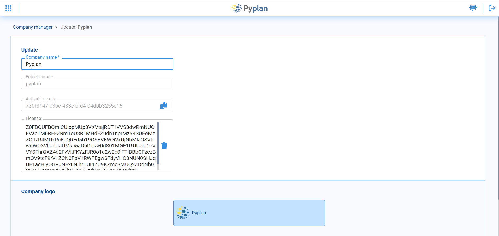

Manage company-level preferences by selecting a company and clicking the **Preferences** button.

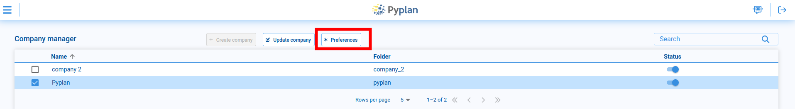

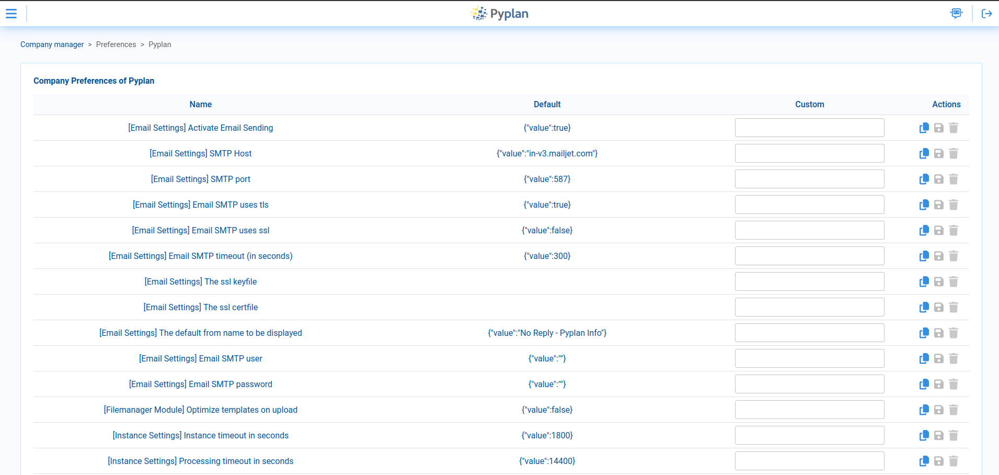

### Email Settings

The **Email Settings** preference module controls how Pyplan sends the notification emails of the platform — including every workflow (Processes) notification. All of these are company preferences, so different companies on the same installation can have different settings.

| Preference | What it does |
| --- | --- |
| `email_service_active` | Master switch. When `false`, nothing is queued or sent for that company. |
| `email_language` | Language of the emails: `en`, `es` or `pt`. Defaults to `en`. |
| `email_default_from_name` | Display name shown as the sender. |
| `smtp_host`, `smtp_port`, `smtp_use_tls`, `smtp_use_ssl`, `smtp_timeout`, `smtp_ssl_keyfile`, `smtp_ssl_certfile` | SMTP server connection. |
| `smtp_user`, `smtp_password` | SMTP credentials. These are read from the `SMTP_USER` / `SMTP_PASSWORD` environment variables of the server, not from the preference value. |

All of them are edited from the same screen: **Company Manager → select the company → Preferences**, shown under [Companies](#companies) above.

Each row shows the platform **Default** and an editable **Custom** value. To override one:

1. Click **Copy Default value** (the copy icon) to bring the default JSON into the Custom box.
2. Edit the value.
3. Click **Save custom value** (the save icon).

**Remove custom value** (the bin icon) drops the override and returns the company to the default.

The remaining icon, **Edit Default value** (the pencil), changes the platform-wide default rather than this company's override, and affects every company that has not set one.

#### Changing the email language

Set the **Custom** value of `[Email Settings] Email language messages (en|es|pt)` to `en`, `es` or `pt`:

```json
{
  "value": "es"
}
```

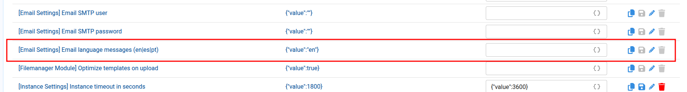

The setting applies to the **whole email**: subject line, body text, status names, and the format of the dates (for example `September 4, 2026, 2:30 p.m.` in English versus `4 de septiembre de 2026 a las 14:30` in Spanish). Any value other than `en`, `es` or `pt` falls back to English.

The language is per company, not per recipient: every user of the company receives the emails in the configured language.

:::note
Dates in emails are always expressed in **UTC**, and the emails say so explicitly next to each date.
:::

#### The email logo

Emails carry their own logo, set separately from the company logo shown on the login page. They are deliberately independent: the mark that works inside the application is often the wrong one on an email card — a dark logo disappears on the white background, and a square crop reads worse than a wide one.

To set it, go to **Company Manager → select the company → Update**, scroll to **Email logo**, and drop the image on the area below it.

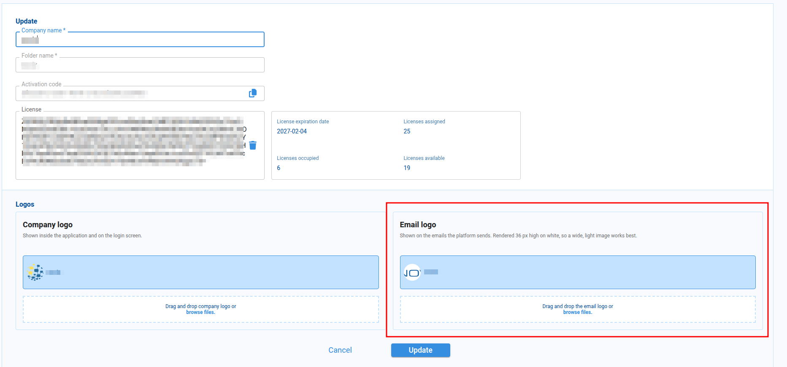

As with the company logo, the file uploads as soon as you drop it — there is no need to press **Save**, which only applies the name, folder and license fields. The **Email logo** section only appears when editing an existing company, not when creating one.

The image must be a **PNG, JPG or GIF**. SVG is accepted by the uploader and renders in the browser, but no major mail client displays it, so emails fall back to the Pyplan logo when the uploaded file is one. It is rendered at 36 px height on a white background, so a wide, light image around 300 × 100 px works best.

Whatever the file is called when you upload it, it is stored under one fixed name in the company's media folder, which is what tells it apart from the company logo sitting in that same directory:

```
<MEDIA_ROOT>/<company_code>/<company logo>      the application logo, under its original name
<MEDIA_ROOT>/<company_code>/email_logo.png      the email logo, always under this name
```

Images that are not already PNG are re-encoded on upload, so the stored file matches the name it is served under.

That file **is** the setting — nothing is recorded in the database. Uploading replaces it, and deleting it from the server removes the logo, with emails going back to the Pyplan one. It also means an administrator with server access can set the logo by placing an `email_logo.png` in the company folder, without going through the interface — which is how installations configured it before this screen existed, and those files keep working untouched.

:::note
Because the file always has the same name, its URL never changes. After replacing the logo, a mail client that already fetched the previous one may keep showing it until its cache expires.
:::

For the logo to reach the recipient, the `CUSTOMER_TRUSTED_ORIGINS` environment variable of the server must contain the public URL of the installation — the image is linked, not attached, and travels as an absolute URL such as `https://<your-host>/media/<company_code>/email_logo.png` — and `/media/` must be publicly served, which it is in the standard nginx configuration.

:::note
Because the image is linked rather than attached, mail clients that block remote images by default will not show it until the reader allows images for that message. This is the deliberate trade-off: attaching the file instead makes every message carry it, and a logo uploaded at full resolution is enough to push a message past the size at which providers stop rendering it — Gmail clips anything over about 102 KB.
:::

If the company has no email logo, or it is in an unsupported format, or the file is missing from disk, emails show the Pyplan logo. Nothing breaks. Note that setting only the *company* logo does not change the emails: the two are separate settings.

##### When the logo does not appear

Emails fall back to the Pyplan logo silently — nothing fails and nothing is reported to the sender — so work through these in order.

**1. Is there a file?** The logo is the file itself, so check it exists on the server:

```bash
ls -l <MEDIA_ROOT>/<company_code>/email_logo.png
```

**2. Is the email being sent by the company you think?** Each email carries the company that owns the thing it is about — the process, in the case of a workflow notification. A process created while logged into company A sends with **A's** logo and **A's** language, whoever the recipients are and whichever companies they belong to. Setting the logo on a different company changes nothing for it.

**3. Is `CUSTOMER_TRUSTED_ORIGINS` set on the server?** The logo travels as an absolute URL, and this variable is where its host comes from. When it is empty, **no logo is emitted at all** — this is the most common cause and the least visible one, because everything else can be perfectly configured.

```bash
# what the API process actually sees, which is what counts
printenv CUSTOMER_TRUSTED_ORIGINS
```

**4. Is that URL current and reachable from outside?** The address has to be the public one for the installation *right now*, and `/media/` has to be served on it:

```bash
curl -o /dev/null -w "%{http_code}\n" https://<your-host>/media/<company_code>/email_logo.png
```

Anything other than `200` and the recipient's mail client will not get the image either. A stale value here — a tunnel or preview URL that has since changed — produces an email with a broken image rather than the Pyplan fallback.

**5. Is the reader's mail client blocking remote images?** Outlook and several others do by default. The image only appears once the reader allows images for that message.

:::warning
On Kubernetes, `CUSTOMER_TRUSTED_ORIGINS` has to be present in the ConfigMap the API and Celery deployments read, and **the pods have to be restarted** after adding it — environment taken through `envFrom` is read when the container starts and does not reload while it is running. Setting it only in a `.env` file used by another deployment method has no effect on the running pods.
:::

### Single Sign-On (SSO) with SAML

To enable SSO with SAML, add a preference called **SAML Configuration** with the following JSON structure:

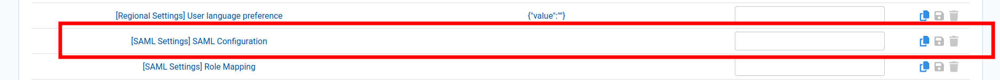

```json
{
  "groups": ["Name of Group"],
  "definition": {
    "service": {
      "sp": {
        "idp": { ... },
        "single_sign_on_service": { ... }
      },
      "name": "Company name",
      "endpoints": { ... }
    },
    "entityid": "string",
    "metadata": { ... }
  },
  "departments": ["departmentCode"],
  "main_department": "string"
}
```

Key fields:
- **groups**: Roles to assign to the user when created. Values must match existing role names in Pyplan.
- **definition**: JSON containing all SAML configuration details (company name, IdP information, connection metadata, etc.).
- **departments**: Department codes to assign to the user when created.
- **main_department**: Main department code for resource usage.

### Role Mapping

To define default roles and departments based on values from Active Directory, add a preference called **Role Mapping**:

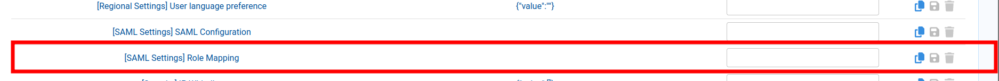

```json
{
    "role": {
        "ManagerFromActiveDirectory": "Administrator",
        "CustomUserActiveDirectory": "Creator"
    },
    "department": {
        "SalesActiveDirectory": ["pyplan-default", "guest"],
        "InvitedActiveDirectory": "guest"
    }
}
```

## Grant/Deny Access to Information

In Pyplan, you can manage access permissions to specific items — such as folders, modules, and interfaces — per department. This allows, for example, departments like Accounting and HR to have different visibility and access within the same application.

### How it works

For each department you can either allow or deny access to selected items:
- If an item is in the **allowed list**, the department can access it.
- If an item is in the **denied list**, the department cannot access it.

Pyplan automatically resolves conflicts:
- If an item is added to the allowed list, it is removed from the denied list.
- If an item is added to the denied list, it is removed from the allowed list.

### What you can control

For each department you can manage access to:
- Interfaces and interface folders
- Folders in the File Manager
- Modules in the influence diagram

### Example 1: Configuring permissions for interfaces

From the Interface Manager:

1. Select one or more interfaces whose access you want to change.
2. Open the permissions dialog.

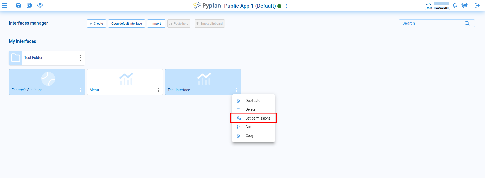

The dialog lets you choose between:
- **Deny access** to selected departments, or
- **Allow access only** to selected departments.

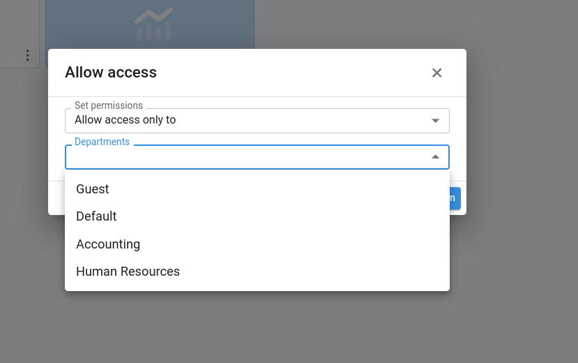

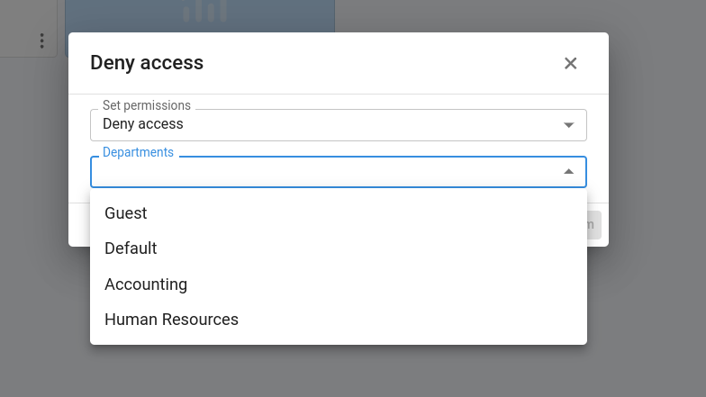

After applying the change, the interface shows a padlock icon to indicate restricted access.

### Example 2: Configuring permissions in the File Manager

In the File Manager, you can restrict one folder at a time:

1. Navigate to the folder you want to restrict.
2. Open its options menu.
3. Use the same permissions dialog.

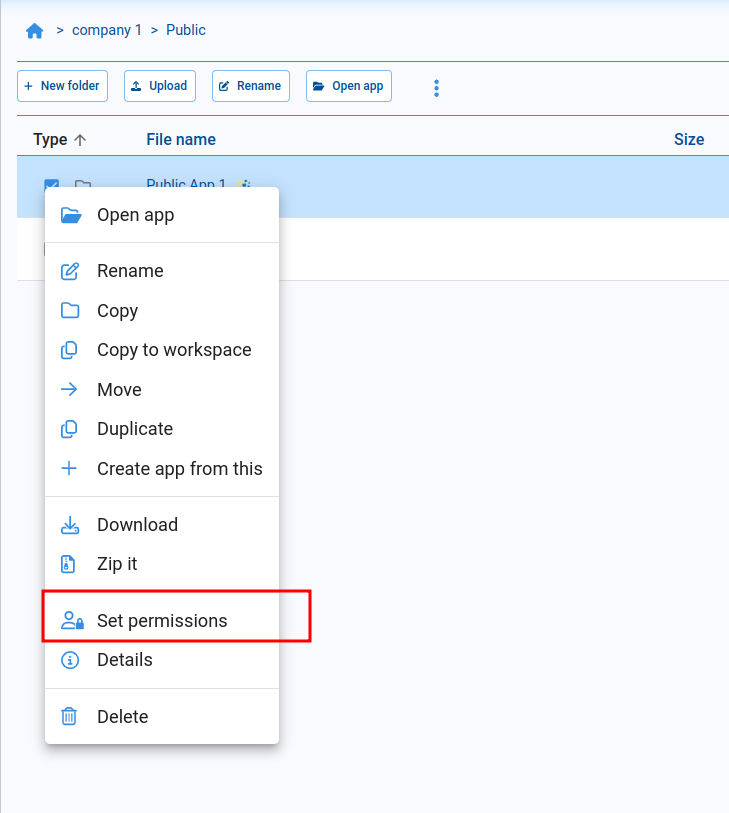

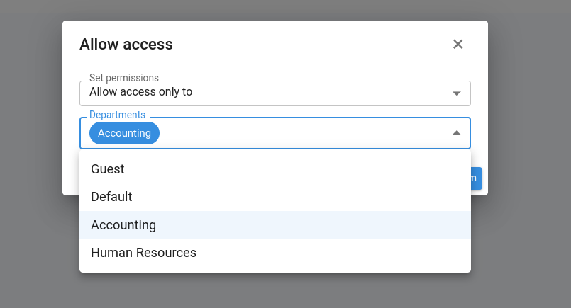

### Example 3: Configuring permissions for modules

To restrict access to diagram modules:

1. Select one or more modules in the influence diagram.
2. Right-click to open the context menu.

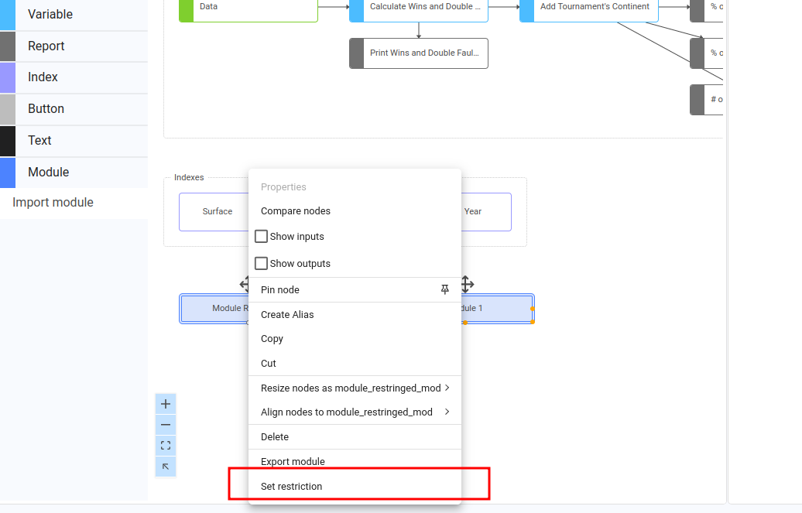

The dialog lets you choose between Deny or Allow access to selected departments.

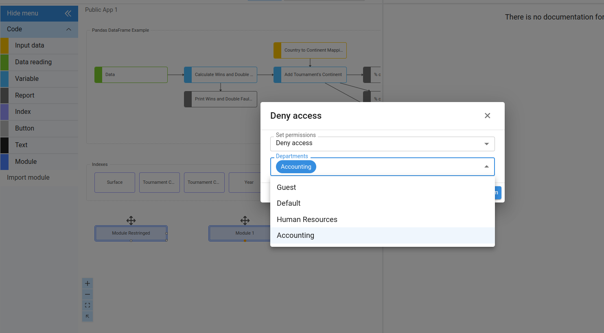

When access to a module is denied for a department, users from that department will not see those modules when opening the diagram.
