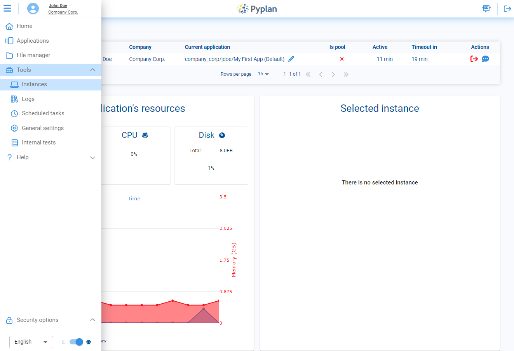
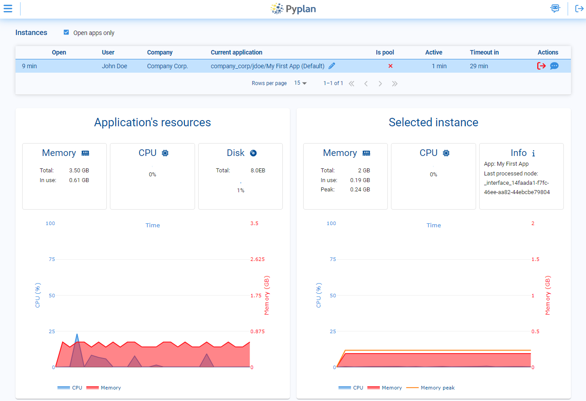

# Instances

The Instances section in Pyplan lets you monitor and manage all active application sessions on the server. From here you can:

- See CPU and RAM usage for each instance, including real-time values and the maximum RAM used during the session.
- Identify which users and applications are consuming more resources.
- Take administrative actions to free resources when necessary, either by closing instances directly or by asking users to close them.

## Instance Manager

The Instance Manager is a central table that shows all active instances in real time. Each row corresponds to one running session and includes the following columns:

| Column | Description |
|---|---|
| **Open** | How long the instance has been running since it started. |
| **User** | The username of the person currently using the instance. |
| **Company** | The company associated with that user. |
| **Current Application** | The application currently open in the instance. |
| **Is Pool** | Indicates whether the instance belongs to a shared pool or is dedicated to a single user. |
| **Active** | Time during which the user has been actively interacting with the application. |
| **Timeout in** | Remaining time before the instance is automatically closed due to inactivity. |
| **Actions** | Administrative actions: **Kill instance** (immediately terminate and release resources) or **Logout required** (send a message asking the user to close the instance voluntarily). |

Next to each instance, three status icons indicate:

- **Processing icon (gears)**: indicates whether the application is currently processing a node.
- **Edit icon (pencil)**: indicates whether the user has edit permissions for the current application.
- **Browser icon (online status)**: indicates whether the user still has the browser open and connected to the instance.

## Selected Instance

When you select a row in the Instance Manager, the **Selected Instance** panel shows detailed information about that specific session:

- **Memory usage**: current RAM consumption and maximum RAM used during the session.
- **CPU usage**: current CPU load for the instance.
- **Application name**: the application running in the instance.
- **Last processed node**: the last node executed in that application, useful for understanding what the instance was doing.

This detailed view helps diagnose performance issues, identify heavy calculations, and manage resources more precisely for each individual instance.
