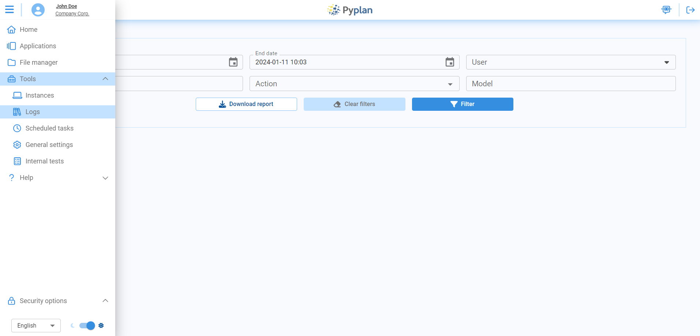
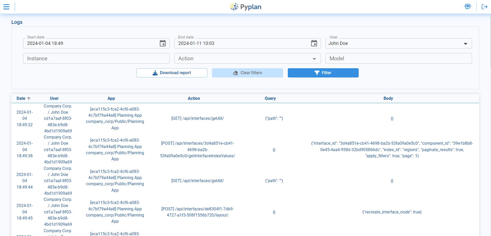

# Logs

The Logs section offers a window into the application's activity timeline. This log captures a series of actions, timestamps, and user details, providing a comprehensive record for users to review and understand the flow of activities. The flexibility to filter logs by date, user, model, instance, and actions ensures a targeted exploration of specific events.

This tool proves invaluable for users seeking transparency and detailed insights into the inner workings of Pyplan.

## Filtering Logs

Easily explore logs with filters that make it straightforward to find and understand specific log entries:

| Filter | Description |
|---|---|
| **Start Date** and **End Date** | Define a specific time frame for log exploration. Maximum range: 7 days. |
| **User** | Isolate and analyze activities associated with a particular user. |
| **Instance** | Trace the sequence of events specific to a chosen instance. |
| **Action** | Refine analysis by selecting a specific action type. |
| **Model (App)** | Focus on activities related to a specific model or application. |

Upon applying filters, each row in the log table signifies a distinct action with the following columns:

| Column | Description |
|---|---|
| **Date** | Chronological timestamp of each log entry — when the corresponding action occurred. |
| **User** | The user associated with each log entry. |
| **App** | The application involved in the logged action. |
| **Action** | The action taken. |
| **Query** | Details of the query associated with the log entry, providing transparency into data retrieval or manipulation processes. |
| **Body** | A snapshot of the content or payload associated with the log entry, providing additional context. |
