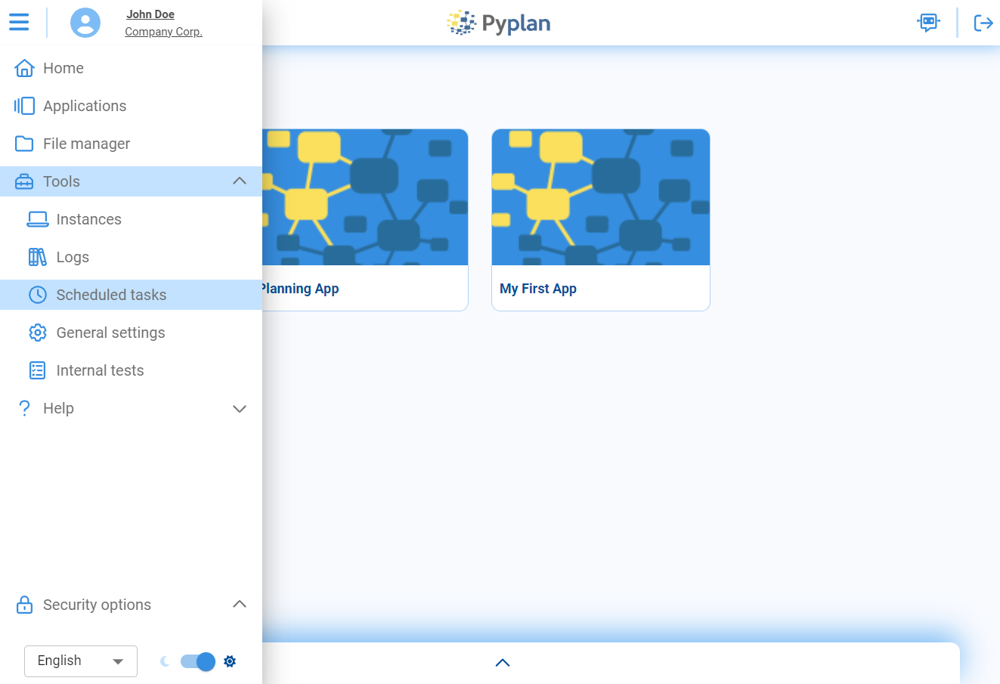
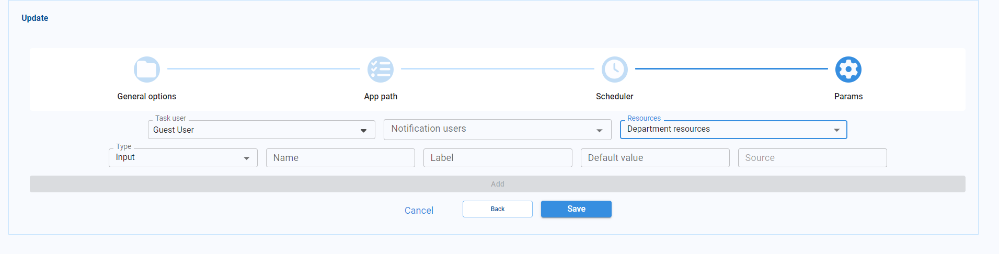
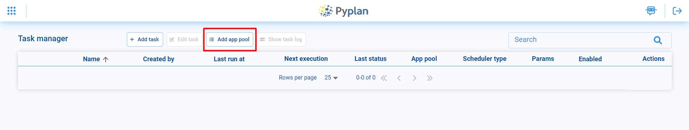
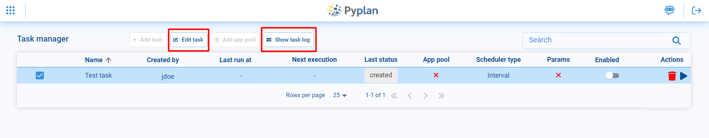
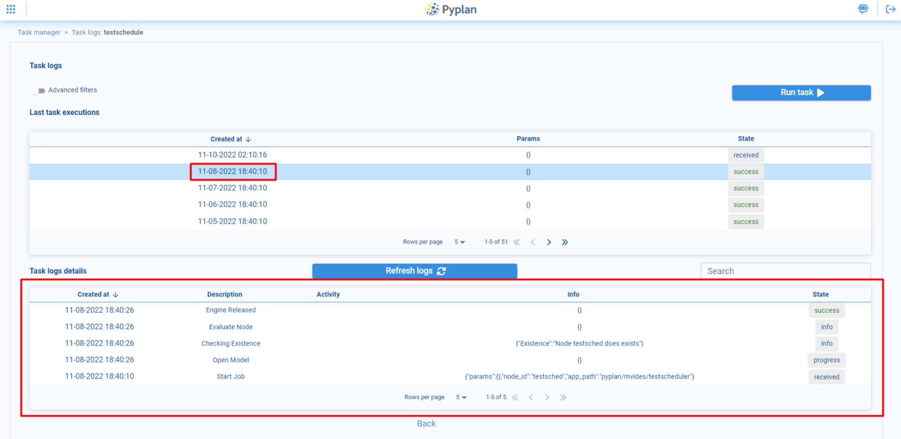

# Scheduled Tasks

Pyplan has a task manager to schedule activities automatically. This tool is available in the left sidebar, under the **Tools** menu, in the **Scheduled tasks** option.

## Tasks

The Tasks section lets you create, manage, and execute automated processes.

### Create Task

To create a scheduled task, select the **Add scheduled task** option at the top.

### General Options

In the General options section, choose a name for the task and indicate whether it will be enabled or not.

### App Path

In the App path section, select the application and the corresponding node to be executed with the scheduled task.

### Scheduler

In the Scheduler option you can select the periodicity of execution. There are 3 options:

1. **Interval**: Run the task every certain time interval (e.g., every day or every hour).
2. **Custom**: Freely schedule execution — select the time or days of the week.
3. **Clocked**: Run the task on a specific day and time.

### Params

The Params section lets you configure:

1. **Task User**: Choose the user responsible for executing the scheduled task. This user will be granted the necessary permissions to initiate the task.
2. **Notification Users**: Specify users who will receive notifications upon completion of the task.
3. **Customized Parameters for Node Execution**: If the scheduled task involves the execution of a node (function) that relies on specific parameters, you can define these parameters:
   - **Select**: Select parameters from a predefined list.
   - **Input**: Enter the value of the parameter.
   - **Checkbox**: Parameters that can take `True` or `False` values.
4. **Resources**: Choose the resources for the instance that will run the task (combination of CPUs and RAM).

## App Pool

An app pool is a tool that allows you to run a node of an application and make it available for other users to access it and continue working once the corresponding node has finished running.

### Create App Pool

Select the **Add app tool** option at the top.

### General Options

In the General options section, choose a name for the app pool and indicate whether it will be enabled.

The **Action on done** option:
1. **Keep for everyone**: Specify the number of apps available after node execution.
2. **Keep for user**: Designate the user with access to the app after node execution.

The **Enable instance expire** option lets you set a time when the app would be shut down.

### App Path

Select the application and the corresponding node to be executed.

### Params

Configuration is the same as for scheduled tasks: Task User, Notification Users, and Customized Parameters for Node Execution.

## Edit and View Logs

To edit any task or app pool, select it and click the **Edit task** option, where you can modify all options that were selected at the time of creation.

You can also monitor the logs of the task/app pool from the **Show task logs** option, where you can see the last times it was executed and review the logs of the corresponding executions.

