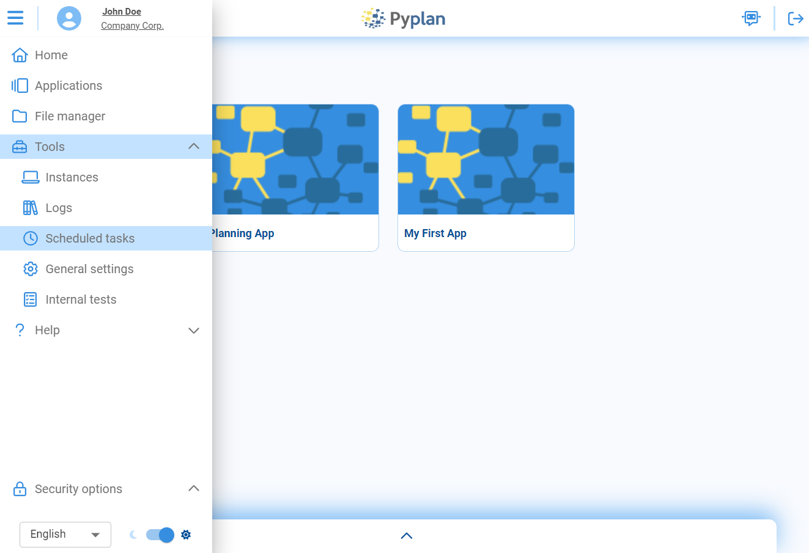
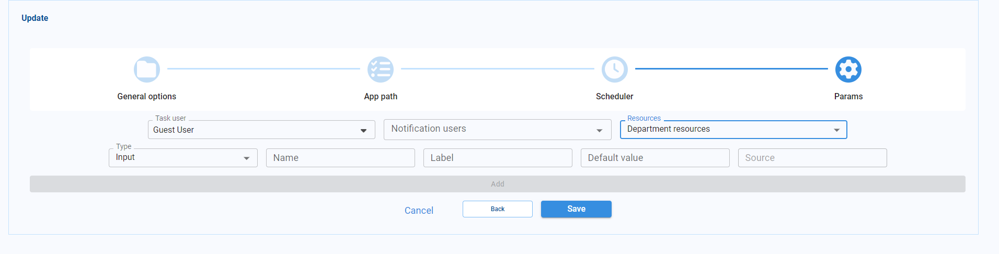
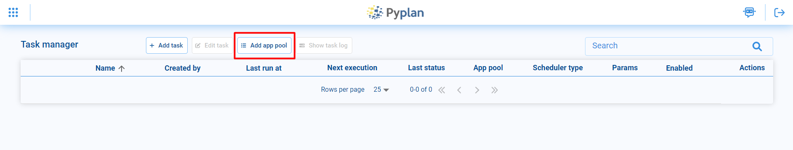
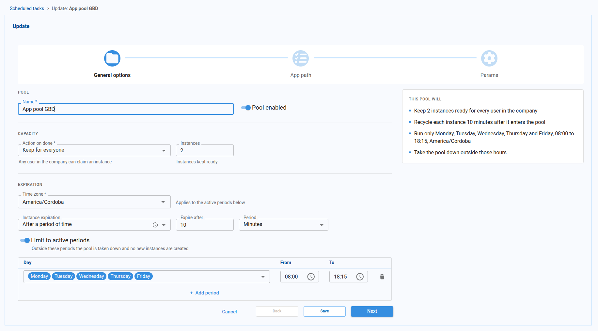
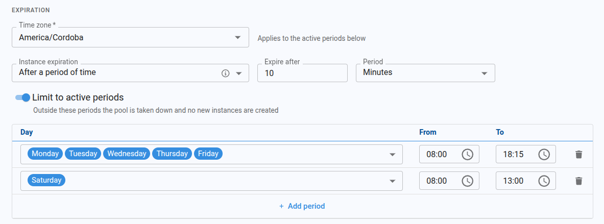
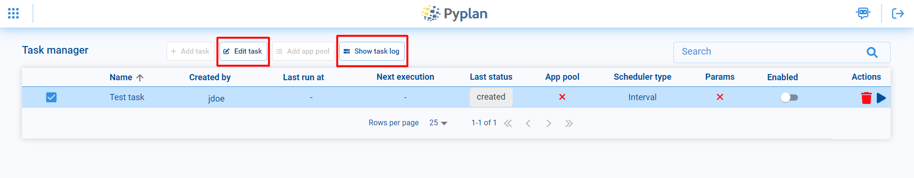
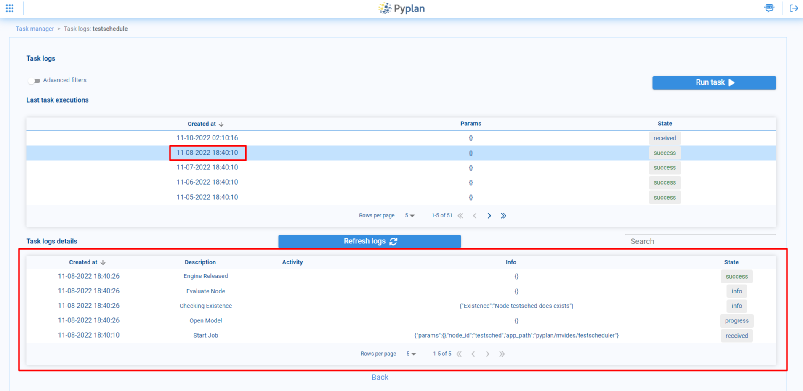

# Scheduled Tasks

Pyplan has a task manager to schedule activities automatically. This tool is available in the left sidebar, under the **Tools** menu, in the **Scheduled tasks** option.

## Tasks

The Tasks section lets you create, manage, and execute automated processes.

### Create Task

To create a scheduled task, select the **Add scheduled task** option at the top.

### General Options

In the General options section, choose a name for the task and indicate whether it will be enabled or not.

### App Path

In the App path section, select the application and the corresponding node to be executed with the scheduled task.

### Scheduler

In the Scheduler option you can select the periodicity of execution. There are 3 options:

1. **Interval**: Run the task every certain time interval (e.g., every day or every hour).
2. **Custom**: Freely schedule execution — select the time or days of the week.
3. **Clocked**: Run the task on a specific day and time.

### Params

The Params section lets you configure:

1. **Task User**: Choose the user responsible for executing the scheduled task. This user will be granted the necessary permissions to initiate the task.
2. **Notification Users**: Specify users who will receive notifications upon completion of the task.
3. **Customized Parameters for Node Execution**: If the scheduled task involves the execution of a node (function) that relies on specific parameters, you can define these parameters:
   - **Select**: Select parameters from a predefined list.
   - **Input**: Enter the value of the parameter.
   - **Checkbox**: Parameters that can take `True` or `False` values.
4. **Resources**: Choose the resources for the instance that will run the task (combination of CPUs and RAM).

## App Pool

An **app pool** keeps one or more instances of an application already open and ready. A pool task runs a node of the application and, once the node finishes, leaves the resulting instance available so that the next user who opens that application continues from there instead of waiting for it to load.

### Create App Pool

We select the **Add app pool** option at the top.

### General Options

The first step of the wizard groups the configuration into three sections: **Pool**, **Capacity** and **Expiration**. On the right, the **This pool will** panel restates the whole configuration in plain sentences, so we can confirm the combination of options we chose without having to work it out ourselves.

#### Pool

We choose a name for the pool and whether it is enabled. A disabled pool keeps its configuration but creates no instances.

#### Capacity

The **Action on done** option defines who can claim the instances the pool keeps ready:

| Option | Who can claim an instance | Instances |
|---|---|---|
| **Keep for everyone** | Any user in the company. | We set how many instances are kept ready. |
| **Keep for departments** | Any member of the departments we choose. | We set how many instances are kept ready. |
| **Keep for user** | Only the user we choose. | One instance. |

When an instance is claimed, the pool creates a new one to replace it, so the configured number stays available.

#### Expiration

Instances that nobody claims can be recycled, so that the application does not stay open with data that is no longer current. The **Time zone** we select here is the one every hour in this section is read in.

The **Instance expiration** option offers three variants:

| Variant | Behaviour |
|---|---|
| **Never expire** | Instances stay in the pool until a user claims one. |
| **At a time of day** | Every instance is recycled when that hour comes, each day. |
| **After a period of time** | Each instance is recycled once it reaches that age, counted from the moment it entered the pool. |

:::info
**After a period of time** cannot be shorter than 10 minutes: below that, an instance would be recycled before it is of any use to whoever opens the application.
:::

An instance that has expired is never handed to a user — it is released and replaced by a new one.

#### Active periods

By default a pool is kept up around the clock. With **Limit to active periods** we restrict it to the stretches of the week when the application is actually used, which avoids holding instances — and the resources they consume — overnight or at weekends.

Each period is a row with the days it applies to and a start and end time. We can add as many periods as we need, for example Monday to Friday from 08:00 to 18:15 plus Saturday from 08:00 to 13:00.

Outside these periods the pool is taken down: the task stops creating instances and releases the ones it is holding. Once a period starts again, the pool refills on its own.

:::info
The start time is included in the period and the end time is not: a period that ends at 18:00 is already closed at 18:00 sharp. A period whose end is earlier than its start crosses midnight — from 22:00 to 06:00 runs into the following day.
:::

### App Path

We select the application and the corresponding node to be executed.

### Params

Configuration is the same as for scheduled tasks: Task User, Notification Users, and Customized Parameters for Node Execution.

## Edit and View Logs

To edit any task or app pool, select it and click the **Edit task** option, where you can modify all options that were selected at the time of creation.

You can also monitor the logs of the task/app pool from the **Show task logs** option, where you can see the last times it was executed and review the logs of the corresponding executions.

