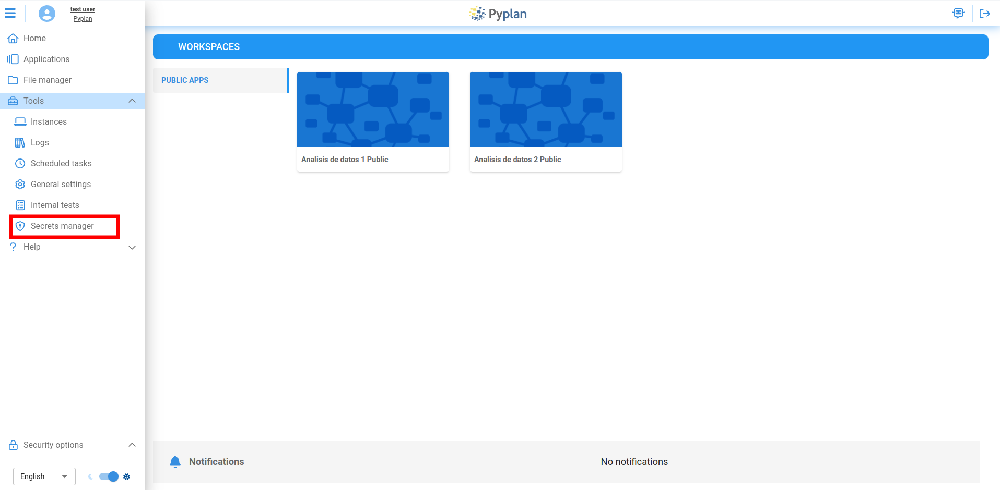
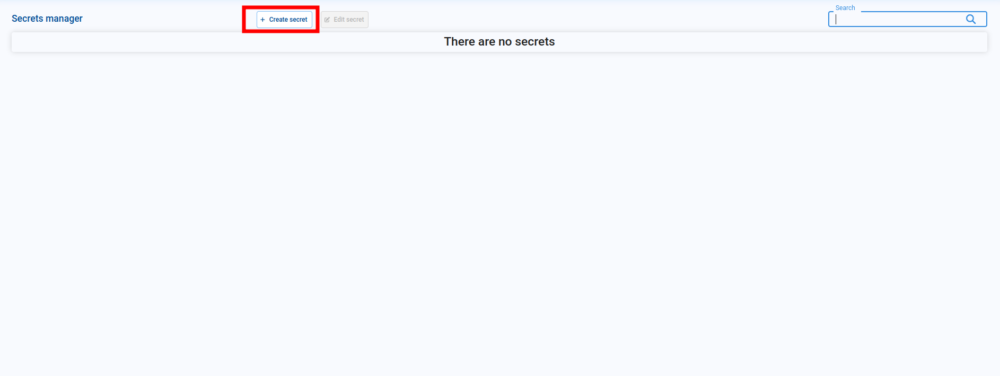
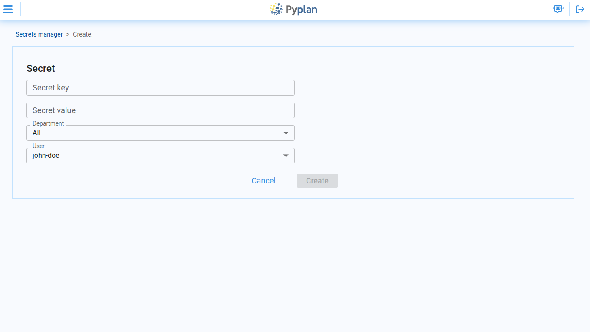
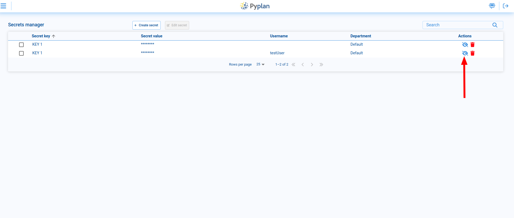
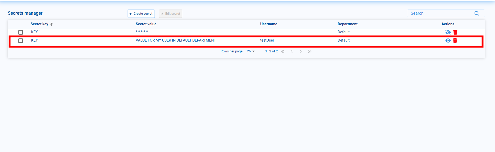
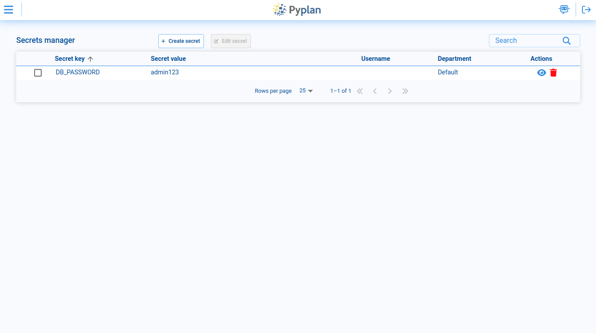
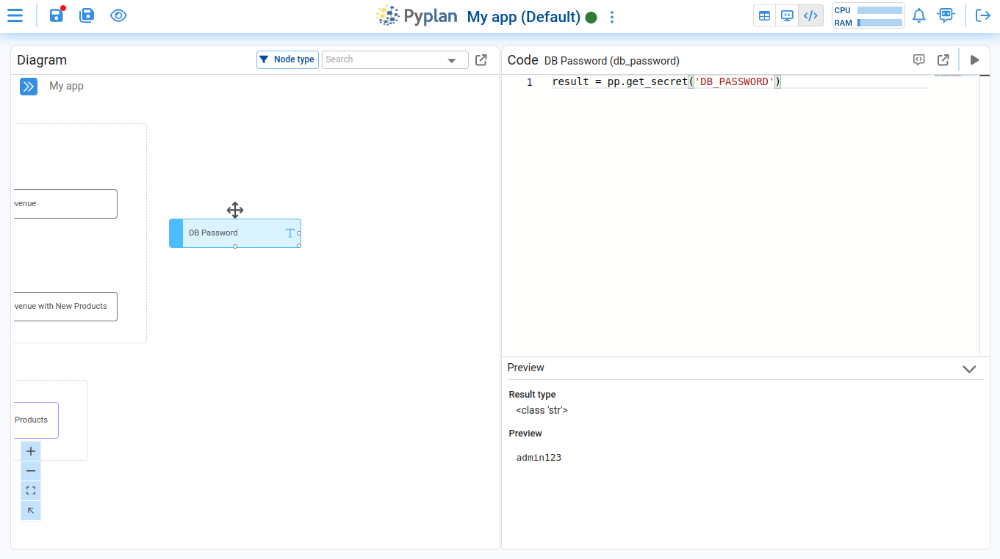
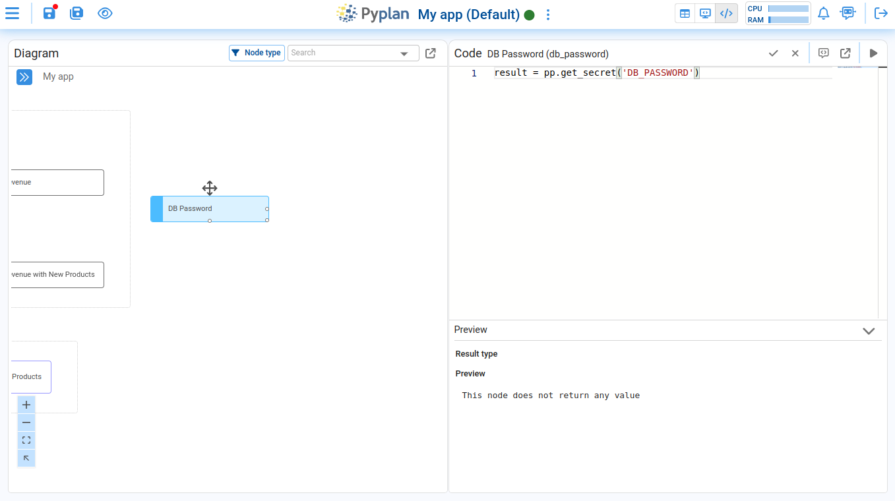
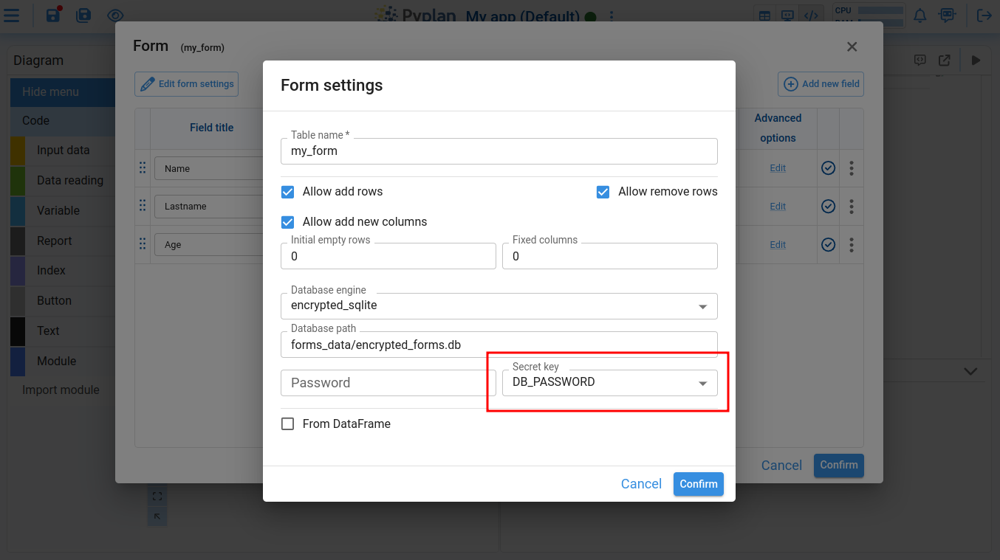

# Secrets Manager

The Secrets Manager is a tool that securely manages keys and passwords on a per-department and per-user basis, ensuring that only authorized users have access to these sensitive credentials.

It can be accessed from the main menu of the application, within the **Tools** submenu.



## Managing Secrets

When you enter the Secrets Manager, a table is displayed with a list of all the secrets the current user can access. To create a new secret, click on the **Create Secret** button.



This opens the secret creation page with the following fields:



| Field | Description |
|---|---|
| **Secret Key** | The identifier key for the secret. The secret's value will be retrieved using this key. |
| **Secret Value** | The actual value of the secret. |
| **Department** | Select one or more departments within the company that should have access to the key. Select `All` to make it visible to all departments. |
| **User** | Choose whether the secret should be accessible to all users in the company (select `All`) or restricted only to the user creating the secret. |

:::note
Only users who meet the specified Department and/or User criteria will be able to access the secret value. This ensures that sensitive information is securely restricted to authorized users within Pyplan.
:::

The same secret key can be used with different department or user configurations. For example, if you create a key called `KEY 1` for all users in the Default department, you can also create a different `KEY 1` value specifically for your user within the Default department — the system will correctly retrieve the value associated with the most specific match.

### Viewing Secret Values

Key values are not displayed in the table by default. To reveal a value, click the show icon on the corresponding row.



The text of the selected row's value will appear. Click the icon again to hide it.



## Retrieving a Secret in Pyplan

To retrieve secrets within the application, use the `pp.get_secret` function:

```python
pp.get_secret(secret_key, department_code=None)
```

**Parameters:**

| Parameter | Description |
|---|---|
| `secret_key` | A string representing the key of the secret. |
| `department_code` | An optional string parameter to force retrieval of the secret key associated with a specific department. |

**Returns:** The secret as a string if a match is found, or `None` if no matching key is found.

## Example Usage

After creating the `DB_PASSWORD` secret:



Access it in a Pyplan node:

```python
result = pp.get_secret('DB_PASSWORD')
```



If another user from a different department (other than the one configured for the key) opens the same app, the function will return `None`:



You can also link a secret to a form database password by editing the settings of the form:



This ensures that only authorized users have permission to read or write to the form.
