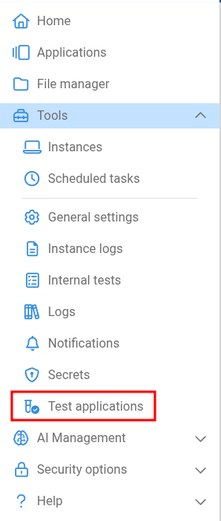
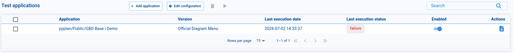
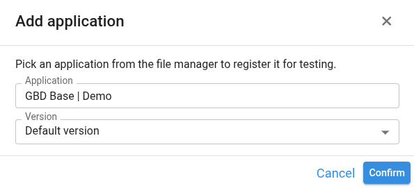
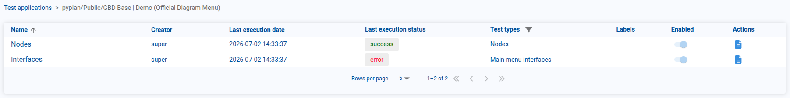
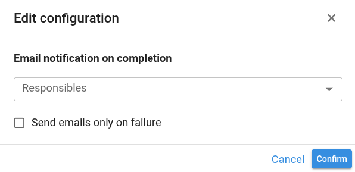

# Test Applications

The **Test Applications** tool lets us run the [automation tests](/user-guide/app-management/automation-tests) of several applications at once — without opening each application — and keep track of how each one performed. It is a central place to register the applications we want to validate, launch their tests, review the resulting logs, and be notified by email when a run finishes.

Unlike the Automation Tests screen, which lives inside a single opened application, Test Applications works across applications and versions: we register each application by its file-manager path and run its tests in the background.

It can be accessed from the main menu of the application, within the **Tools** submenu.

:::info Access permission
Access to this tool requires the **Manage test applications** permission. It is granted to the **Super Administrator** and **Administrator** roles by default, and can be assigned to other roles from the [Permissions by role](/user-guide/security-options) screen.
:::

## The Test Applications table

When we open the tool, a table lists every registered application, one row per **application + version**:

| Column | Description |
|---|---|
| **Checkbox** | Selects the row. The header checkbox selects or clears every row on the current page. Selected applications are the ones a run will execute. |
| **Application** | The path of the application (as it appears in the File Manager). |
| **Version** | The application version the tests will run against. |
| **Last execution date** | When the application's tests were last run from this tool. |
| **Last execution status** | The aggregated result of the last run: *success*, *error*, *in progress*, or empty if it has never run. |
| **Enabled** | A switch that includes or excludes the application from runs. Disabled applications are kept in the list but skipped when running. |
| **Actions** | **View logs** opens the read-only execution logs for that application (see [Viewing execution logs](#viewing-execution-logs)). |

We can filter the list with the **search** box and move through pages with the pagination controls at the bottom.

:::note Which applications we see
The applications shown depend on our company access. With the **View all companies** permission we see every registered application. Otherwise, we only see applications that belong to the companies we are assigned to, and — for applications stored in a **Team** workspace — only those in teams we have read access to.
:::

## Registering an application

To add an application to the list, we click **Add application**.

1. Click the **Application** field to open the File Manager tree and select the application we want to test.
2. Optionally, choose a specific **Version** from the selector. If we leave it on **Default version**, the application's default version is used.
3. Click **Confirm** to register the application.

The application then appears as a new row in the table, ready to be run.

## Running tests

We can run the tests of one or more applications at the same time:

1. Select the applications to run using the row checkboxes (or the header checkbox to select the whole page). Only **enabled** applications are executed.
2. Click the **Run** button in the toolbar.

The tests run in the background, so we do not need to keep the applications open. Each selected application's status changes to **in progress** while its tests run, and updates to **success** or **error** when the run finishes.

:::tip
A run executes all of the **enabled** tests of each selected application, across every department those tests target.
:::

## Viewing execution logs

The **View logs** action on a row opens a read-only view of that application's tests — the same layout as the [Automation Tests](/user-guide/app-management/automation-tests) screen, but without options to create, edit, delete, or run tests. From here we can only inspect the results.

1. The first screen lists all the tests of the application.
2. Selecting a test's **View logs** action opens its execution logs, grouped by department, with the detail of each run.

The breadcrumb at the top lets us navigate back to the application's test list and to the main Test Applications table.

## Email notifications

We can configure Pyplan to email a summary to the people responsible after every run. Click **Edit configuration** to open the settings.

| Setting | Description |
|---|---|
| **Responsibles** | The platform users who receive the run-summary email. |
| **Send emails only on failure** | When enabled, the email is sent only if at least one application in the run failed. When disabled, an email is sent after every run. |

This configuration is **global** for the whole Test Applications tool. When a run finishes, a single summary email is sent to the configured responsibles, listing each application's status and the number of tests that passed and failed.
